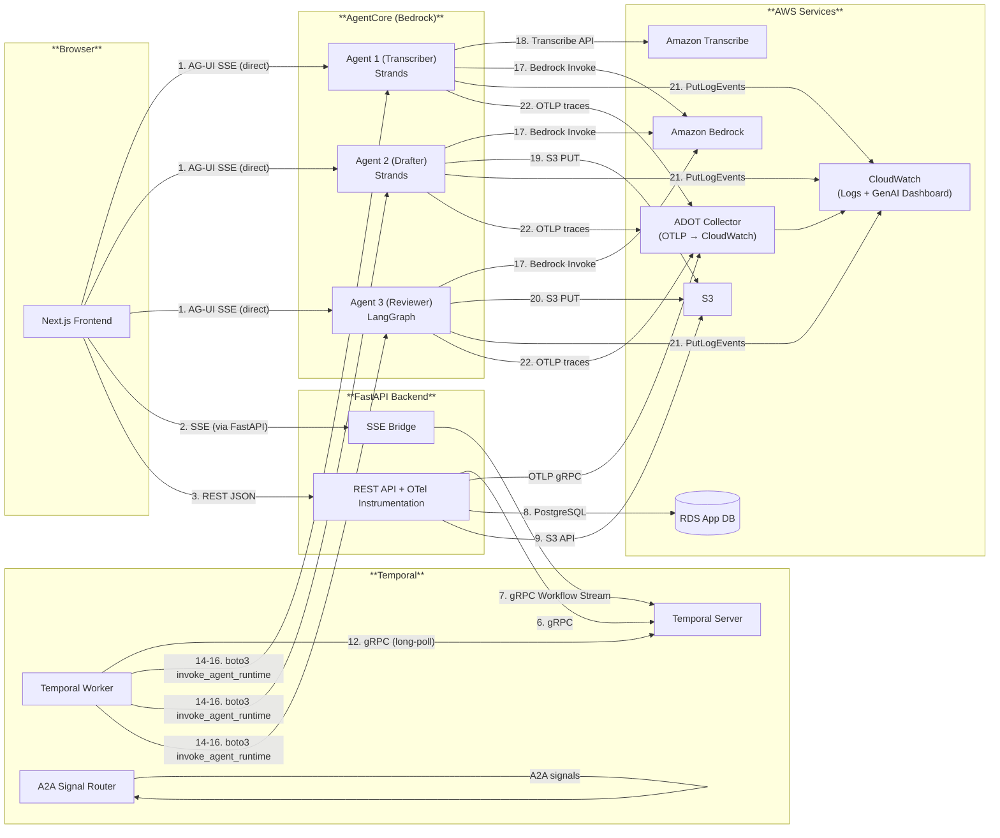
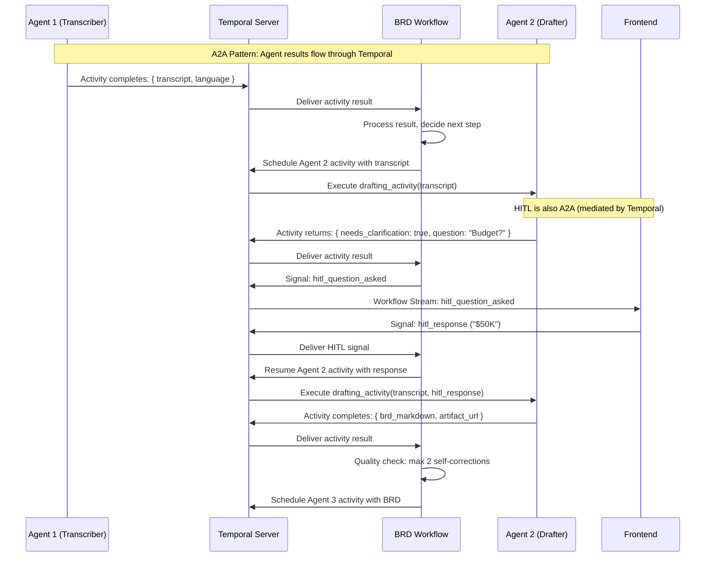

# AgentCore demo test 1 System: Comprehensive Architecture & Data Flow Guide

**Date:** 2026-05-12
**Author:** Principal Solutions Architect
**Classification:** Architecture Reference — Authoritative
**Review Cycle:** Quarterly or on major version change

---

## Table of Contents

1. [System Architecture Overview](#section-1-system-architecture-overview)
   - 1.1 Five-Layer Architecture Stack
   - 1.2 Component Inventory
   - 1.3 Communication Matrix
   - 1.4 Decision Record: Why Hybrid Architecture?
2. [The Dual-Stream Architecture](#section-2-the-dual-stream-architecture)
   - 2.1 Stream 1: AG-UI (AgentCore → Browser)
   - 2.2 Stream 2: Temporal Workflow Stream
   - 2.3 Agent-to-Agent (A2A) Communication
   - 2.4 Why Two Streams? (Decision Record)
   - 2.5 Event Type Mapping
3. [Complete Data Flow by Phase](#section-3-complete-data-flow-by-phase)
   - Phase A: Audio Upload
   - Phase B: Workflow Initiation
   - Phase C: Transcription (Agent 1)
   - Phase D: HITL Clarification
   - Phase E: BRD Draft (Agent 2)
   - Phase F: Review (Agent 3)
   - Phase G: Final Approval + Evidence Pack
4. [Payload Routing Map](#section-4-payload-routing-map)
   - 4.1 The 8-Block V5 Payload Journey
   - 4.2 Trace Propagation Chain
   - 4.3 OpenTelemetry + ADOT Emission Flow
   - 4.4 Identifier Lifecycle
5. [Data Persistence Map](#section-5-data-persistence-map)
   - 5.1 RDS `temporal` Database
   - 5.2 RDS `agentcore_demo_test1` Database
   - 5.3 S3 Buckets
   - 5.4 CloudWatch Log Groups
   - 5.5 Temporal Event History
6. [AG-UI vs A2A vs Temporal — Layer Analysis](#section-6-ag-ui-vs-a2a-vs-temporal--layer-analysis)
   - 6.1 What AG-UI Does
   - 6.2 What A2A Does
   - 6.3 What Temporal Does
   - 6.4 Why They Are Complementary
   - 6.5 Architecture Decision Matrix
7. [AgentCore Session Isolation & MicroVM Architecture](#section-7-agentcore-session-isolation--microvm-architecture)
   - 7.1 MicroVM Per Session
   - 7.2 S3 Zip Deployment (No Containers)
   - 7.3 Session ID Strategy
   - 7.4 Cost Implications
   - 7.5 Security Model
8. [Component Interaction Matrix](#section-8-component-interaction-matrix)
   - 8.1 Interaction Table
   - 8.2 Failure Modes
   - 8.3 Recovery Procedures

---

## Section 1: System Architecture Overview

### 1.1 Five-Layer Architecture Stack

The AgentCore demo test 1 system is built as a **five-layer hybrid architecture** that combines the strengths of real-time agent streaming (AG-UI) with durable workflow orchestration (Temporal). Each layer has a clearly defined responsibility, communicates through well-defined protocols, and can be independently scaled, replaced, or debugged.

The fundamental design principle is **separation of concerns**: real-time user-facing streaming is handled by one subsystem (AG-UI), durable workflow orchestration by another (Temporal), and agent-to-agent communication by a third (A2A via Temporal signals). These subsystems never directly communicate with each other; they are merged only at the frontend canvas layer where the user experiences a unified, coherent interface.

#### Layer 1 — Frontend (Next.js 14+ App Router)

| Attribute | Value |
|---|---|
| **Role** | User interface, real-time canvas, dual-stream event consumer, state machine |
| **Framework** | Next.js 14+ (App Router), React 18+, TypeScript 5.3+ |
| **Styling** | Tailwind CSS 3.4+, shadcn/ui component library |
| **Agent UI Framework** | CopilotKit >= 1.50 (AG-UI protocol consumer) |
| **State Management** | Zustand (canvas state), React Query (server state) |
| **Streaming** | Two independent SSE subscriptions |
| **Protocols** | HTTP/2, Server-Sent Events (SSE), WebSocket (fallback) |
| **Authentication** | Mock auth (demo-user-001) |
| **Key Files** | `useAgent.ts`, `useWorkflowStream.ts`, `CanvasStateMachine.tsx` |

The frontend is a Next.js 14+ application using the App Router architecture. It serves as the primary user interface for the AgentCore demo test 1 system and is responsible for consuming two independent real-time streams: the AG-UI stream (direct from AgentCore) and the Temporal Workflow Stream (via FastAPI SSE bridge). The frontend does not know that these are two separate streams; it merges them in a Zustand-based canvas state machine that presents a unified view to the user.

The frontend uses CopilotKit >= 1.50 as the AG-UI framework, which provides the `useAgent` hook for connecting to the AgentCore AG-UI endpoint. CopilotKit handles the low-level SSE connection management, event parsing, and message rendering, while the custom `useWorkflowStream` hook handles the Temporal Workflow Stream.

The canvas state machine (`CanvasStateMachine.tsx`) is the heart of the frontend. It receives events from both streams and determines how to update the UI. For example, when a `TEXT_MESSAGE_CONTENT` event arrives from the AG-UI stream, the state machine appends the text to the current message bubble. When an `agent_1_completed` event arrives from the Workflow Stream, the state machine transitions the workflow phase from `TRANSCRIBING` to `TRANSCRIPTION_COMPLETE`.

#### Layer 2 — FastAPI Backend (Python 3.11)

| Attribute | Value |
|---|---|
| **Role** | REST API, SSE bridge, evidence pack builder, S3 handler, OTel instrumentation |
| **Framework** | FastAPI 0.115+, Python 3.11+ |
| **ASGI Server** | Uvicorn 0.32+ (with `--loop uvloop --http httptools`) |
| **Key Libraries** | `temporalio`, `boto3`, `aiobotocore`, `psycopg3`, `pydantic v2`, `opentelemetry-api`, `opentelemetry-sdk`, `opentelemetry-instrumentation-fastapi` |
| **Protocols** | HTTP/1.1 REST, SSE (Server-Sent Events), gRPC (to Temporal Server) |
| **Concurrency** | `asyncio` with `async`/`await` throughout |
| **Authentication** | Mock auth (no JWT) via `X-Mock-User` header |
| **Key Files** | `main.py`, `workflow_routes.py`, `sse_bridge.py`, `evidence_pack.py`, `s3_handler.py`, `otel_setup.py` |

The FastAPI backend serves three primary functions: (1) it exposes REST endpoints for workflow lifecycle management (start, signal, query, status), (2) it acts as an SSE bridge that forwards Temporal Workflow Streams to the browser, and (3) it performs auxiliary tasks such as building evidence packs, handling S3 claim-checks, and instrumenting OpenTelemetry traces.

The FastAPI backend does NOT sit between the AG-UI stream and the browser. The AG-UI stream flows directly from AgentCore to the browser, bypassing FastAPI entirely. This is a deliberate architectural decision to minimize latency for real-time agent events and to avoid coupling the agent layer to the orchestration layer.

The SSE bridge (`sse_bridge.py`) is a critical component. It opens a persistent SSE connection to the Temporal Workflow Stream and forwards events to the browser via another SSE connection. The bridge maintains an in-memory event buffer (configurable, default 1000 events) to handle browser reconnections. When a browser reconnects, the bridge replays buffered events so the user does not miss workflow phase transitions.

OpenTelemetry instrumentation is applied to FastAPI via `opentelemetry-instrumentation-fastapi`. All incoming requests automatically generate spans with `jnj.*` attribute prefixes per the V5 telemetry specification. The OTel tracer propagates `traceparent` headers through all outgoing gRPC calls to Temporal and HTTP calls to AWS services.

#### Layer 3 — Temporal Orchestration (Self-Hosted)

| Attribute | Value |
|---|---|
| **Role** | Workflow orchestration, durable execution, HITL signal loop, event history, A2A communication |
| **Platform** | Temporal Server (self-hosted via docker-compose) |
| **Version** | Temporal Server 1.25+, Temporal SDK Python 1.9+ |
| **gRPC Port** | 7233 (client connections) |
| **Web UI Port** | 8081 (admin dashboard) |
| **Worker** | Same Docker image as FastAPI (separate process) |
| **Workflow Definition** | `@workflow.defn` class with HITL signal loop |
| **Max HITL Rounds** | 5 rounds (every HITL turn = workflow step) |
| **Max Self-Corrections** | 2 self-corrections before HITL escalation |
| **HITL Timeout** | 15 minutes per round |
| **Event History Limit** | 50 MB per workflow execution |
| **ContinueAsNew Trigger** | >24h runtime OR >50% event history limit |
| **Persistence** | PostgreSQL 15+ (`temporal` database) |
| **Key Files** | `brd_workflow.py`, `activities.py`, `worker.py` |

The Temporal layer is responsible for all workflow orchestration and agent-to-agent (A2A) communication in the AgentCore demo test 1 system. It defines the BRD workflow as a durable, stateful execution that survives crashes, retries failed activities, coordinates human-in-the-loop (HITL) interactions via signals, and handles A2A messaging between agents.

The Temporal Server is deployed via docker-compose alongside the PostgreSQL persistence backend. The Temporal Worker runs as a separate process (or container) from the FastAPI web server, consuming tasks from the task queue and executing activities. Both the Worker and the FastAPI server share the same codebase and Docker image, but they run as separate processes to allow independent scaling.

The BRD workflow (`brd_workflow.py`) defines the orchestration logic: it sequences the three agents (transcriber → drafter → reviewer), handles HITL clarification rounds (every HITL interaction is a distinct workflow step), manages the approval/rejection flow, implements the ContinueAsNew pattern for long-running workflows, and ensures that an evidence pack is produced regardless of the final outcome (APPROVED, REJECTED, TERMINATED, or FAILED).

**A2A Communication via Temporal Signals:** Agent-to-agent communication does NOT happen directly. When Agent 2 needs to send a result to Agent 3, the Temporal workflow receives the output from Agent 2's activity and passes it as input to Agent 3's activity. For HITL interactions, Temporal signals carry clarification requests and responses between the frontend and the drafter agent. This signal-based A2A pattern is durable, traceable, and recoverable.

#### Layer 4 — Agent Runtime (AWS Bedrock AgentCore)

| Attribute | Value |
|---|---|
| **Role** | Agent hosting, agent execution, AG-UI event emission, session isolation |
| **Platform** | AWS Bedrock AgentCore Runtime |
| **Deployment** | S3 zip deployment via `agentcore configure` + `agentcore deploy` (no containers, no ECR) |
| **Agents** | Agent 1 (Transcriber — Strands), Agent 2 (BRD Drafter — Strands), Agent 3 (BRD Reviewer — LangGraph) |
| **V5 Invoke Endpoint** | `POST /invoke` (internal, port 8080) — mapped from `/invocations` externally |
| **Metadata Endpoint** | `GET /metadata` (internal, port 8080) |
| **Capabilities Endpoint** | `GET /capabilities` (internal, port 8080) |
| **Metrics Endpoint** | `GET /metrics` (internal, port 8080) |
| **Health Endpoint** | `GET /health` (internal, port 8080) — mapped from `/ping` externally |
| **External Endpoint** | `POST /invocations` (AgentCore maps → `/invoke`), `GET /ping` (AgentCore auto-handles) |
| **Protocol** | AG-UI (Agent User Interface) over SSE |
| **Session Isolation** | `X-Amzn-Bedrock-AgentCore-Runtime-Session-Id` header |
| **Authentication** | Mock auth |
| **MicroVM** | Firecracker-based, per-session isolation |
| **Framework Support** | Strands (Agents 1 & 2), LangGraph (Agent 3), CrewAI, etc. |
| **Key Package** | `bedrock-agentcore` (runtime SDK with `@app.entrypoint`) |

The Agent Runtime layer hosts the three AI agents that perform the actual work of the AgentCore demo test 1 system. Each agent runs in its own **AgentCore Firecracker MicroVM** — NOT on EC2 instances, NOT in ECS containers, NOT in EKS pods. Every workflow execution spawns a dedicated ARM64 MicroVM with its own kernel, providing hardware-level isolation between sessions.

> **Critical Clarification:** Agents NEVER run on developer-managed EC2 instances. The MicroVM is provisioned automatically by the AgentCore service when an activity invokes the agent. The developer's only responsibility is packaging agent code as a ZIP file and deploying via `agentcore configure/deploy`. AgentCore handles MicroVM provisioning, runtime building, and teardown.

**Deployment Method — S3 Zip (No Containers):** Agents are deployed as S3 zip packages, NOT as container images. The developer runs `agentcore configure -e main.py --protocol AGUI` which creates an S3 bucket, IAM role, and build configuration. Then `agentcore deploy` packages the code into a ZIP file, uploads it to S3, triggers CodeBuild to build an ARM64 runtime, and deploys the AgentCore Runtime. No Dockerfile, no ECR repository, no container registry.

AgentCore is framework-agnostic: it can host agents built with Strands, LangGraph, CrewAI, or any other framework. Our architecture uses **2 Strands agents + 1 LangGraph agent**:
- **Agent 1 (Transcriber)** and **Agent 2 (BRD Drafter)** are built with Strands
- **Agent 3 (BRD Reviewer)** is built with LangGraph `StateGraph` with 4 nodes (`review_compliance`, `review_quality`, `review_pii`, `compile_report`)

The `bedrock-agentcore` package provides the `BedrockAgentCoreApp` class and the `@app.entrypoint` decorator. The developer writes their agent code using standard framework patterns, decorates the entry point with `@app.entrypoint`, and AgentCore handles the rest — including automatic mapping of `/invocations` → `/invoke` and `/ping` → health check.

The AG-UI protocol is the key innovation at this layer. It defines a standard event format for agent↔user communication, including event types like `TEXT_MESSAGE_CONTENT`, `TOOL_CALL_START`, `TOOL_CALL_END`, `STATE_DELTA`, and `CUSTOM`. These events are streamed to the browser via SSE, providing real-time visibility into what the agent is doing.

#### Layer 5 — Storage & Observability

| Attribute | Value |
|---|---|
| **Role** | Data persistence, object storage, metrics, logging, tracing |
| **Database (Temporal)** | RDS PostgreSQL: `temporal` database |
| **Database (App)** | RDS PostgreSQL: `agentcore_demo_test1` database |
| **Object Storage** | S3: `audio-uploads`, `artifacts`, `claimcheck` buckets |
| **S3 Filesystem (New)** | S3/EFS mountable as local filesystem in MicroVM (May 2026) |
| **Metrics** | CloudWatch via OpenTelemetry + ADOT Collector |
| **Dashboards** | CloudWatch GenAI Observability Dashboard |
| **Alarms** | CloudWatch Alarms |
| **Tracing** | OpenTelemetry with W3C trace propagation, `jnj.*` attribute prefix |
| **Log Groups** | 4 CloudWatch Log Groups (see Section 5.4) |
| **OTel Collector** | AWS Distro for OpenTelemetry (ADOT) on EC2 |
| **OTel Export** | OTLP gRPC (port 4317) → ADOT Collector → CloudWatch |

The Storage & Observability layer provides the persistence and monitoring infrastructure for the entire system. It includes two PostgreSQL databases (one for Temporal Server, one for application data), three S3 buckets for object storage, CloudWatch for metrics and logging, and OpenTelemetry with the AWS Distro for OpenTelemetry (ADOT) Collector for distributed tracing.

**OpenTelemetry + ADOT Architecture:** All five layers participate in distributed tracing via OpenTelemetry with W3C trace propagation. A `traceparent` header is generated at the browser, propagated through FastAPI to Temporal, through activities to AgentCore, and finally to the Bedrock model invocation. The standard `opentelemetry-sdk` is used in Python code (NO custom SDK). Spans are exported via OTLP gRPC to the ADOT Collector running on EC2, which forwards them to CloudWatch. All custom attributes use the `jnj.*` prefix per the V5 specification. Span events are used for tool calls and payload emission points.

All five layers participate in distributed tracing via OpenTelemetry with W3C trace propagation. A `traceparent` header is generated at the browser, propagated through FastAPI to Temporal, through activities to AgentCore, and finally to the Bedrock model invocation. This allows full end-to-end correlation of every request across all layers.

---

### System Architecture Diagram (Mermaid)

```mermaid
flowchart TB
    subgraph L1["**Layer 1: Frontend (Next.js 14+)""]
        direction TB
        FE["Next.js App Router<br/>React + Tailwind + CopilotKit"]
        U1["useAgent hook<br/>(AG-UI SSE → AgentCore)"]
        U2["useWorkflowStream hook<br/>(SSE → FastAPI)"]
        CS["Canvas State Machine<br/>(Zustand)"]
        FE --> U1
        FE --> U2
        U1 --> CS
        U2 --> CS
    end

    subgraph L2["**Layer 2: FastAPI Backend**"]
        direction TB
        API["FastAPI REST Endpoints<br/>/api/workflows/*"]
        SSE["SSE Bridge<br/>(workflow_stream)"]
        EP["Evidence Pack Builder"]
        S3H["S3 Claim-Check Handler"]
        OTEL["OpenTelemetry Instrumentation<br/>(jnj.* attributes)"]
        API --> SSE
        API --> EP
        API --> S3H
        API --> OTEL
    end

    subgraph L3["**Layer 3: Temporal Orchestration**"]
        direction TB
        TS["Temporal Server<br/>gRPC:7233 WebUI:8081"]
        TW["Temporal Worker"]
        WF["BRD Workflow<br/>(HITL signal loop, A2A)"]
        ACT["Activities<br/>(boto3 → AgentCore)"]
        A2A["A2A: Temporal Signals<br/>(agent↔agent communication)"]
        TS --> TW
        TW --> WF
        WF --> ACT
        WF --> A2A
    end

    subgraph L4["**Layer 4: Agent Runtime (Bedrock AgentCore)**"]
        direction TB
        A1["Agent 1: Transcriber<br/>Strands | microVM (Firecracker)"]
        A2["Agent 2: BRD Drafter<br/>Strands | microVM (Firecracker)"]
        A3["Agent 3: BRD Reviewer<br/>LangGraph StateGraph | microVM (Firecracker)"]
        AGUI["AG-UI Protocol<br/>SSE Events"]
        DEPLOY["S3 Zip Deployment<br/>(agentcore configure/deploy)"]
        A1 --> AGUI
        A2 --> AGUI
        A3 --> AGUI
        DEPLOY --> A1
        DEPLOY --> A2
        DEPLOY --> A3
    end

    subgraph L5["**Layer 5: Storage & Observability**"]
        direction TB
        DB1[("RDS PostgreSQL<br/>temporal DB")]
        DB2[("RDS PostgreSQL<br/>agentcore_demo_test1 DB")]
        S3["S3 Buckets<br/>audio-uploads / artifacts / claimcheck"]
        CW["CloudWatch<br/>Logs / Metrics / GenAI Dashboard"]
        ADOT["ADOT Collector (EC2)<br/>OTLP gRPC:4317 → CloudWatch"]
        OTEL_PY["opentelemetry-sdk<br/>(standard Python SDK)"]
    end

    %% Cross-layer connections
    U1 -. "SSE (direct AG-UI)" .-> AGUI
    U2 -. "SSE" .-> SSE
    SSE -. "gRPC Workflow Stream" .-> TS
    API -. "gRPC" .-> TS
    ACT -. "boto3 invoke_agent_runtime" .-> A1
    ACT -. "boto3 invoke_agent_runtime" .-> A2
    ACT -. "boto3 invoke_agent_runtime" .-> A3
    A2A -. "Temporal signals" .-> A2A
    TS --> DB1
    API --> DB2
    ACT --> S3H
    S3H --> S3
    OTEL -. "OTLP gRPC" .-> ADOT
    ADOT --> CW
    AGUI -. "traceparent" .-> OTEL_PY
    API -. "traceparent" .-> OTEL_PY
    OTEL_PY -. "OTLP" .-> ADOT
```

---

### 1.2 Component Inventory

The following table inventories every component in the AgentCore demo test 1 system, organized by layer. Each component is listed with its name, layer, primary purpose, technology stack, network port (if applicable), and key dependencies.

| # | Component Name | Layer | Purpose | Technology | Port | Key Dependencies |
|---|---|---|---|---|---|---|
| 1 | Next.js Frontend | Layer 1 | User interface, dual-stream consumer, canvas | Next.js 14+, React 18+, Tailwind, CopilotKit 1.50+ | 3000 (dev) / 80 (prod) | AgentCore (AG-UI SSE), FastAPI (SSE) |
| 2 | `useAgent` Hook | Layer 1 | AG-UI SSE connection to AgentCore | CopilotKit `useAgent` | N/A | AgentCore `/invocations` endpoint |
| 3 | `useWorkflowStream` Hook | Layer 1 | SSE connection to FastAPI for workflow events | Custom hook, EventSource API | N/A | FastAPI `/api/workflows/{id}/stream` |
| 4 | Canvas State Machine | Layer 1 | Merges dual streams into unified UI state | Zustand, TypeScript | N/A | Both streams, UI components |
| 5 | Auth Client | Layer 1 | Mock authentication | `X-Mock-User` header | N/A | Mock auth |
| 6 | FastAPI Server | Layer 2 | REST API, SSE bridge, auxiliary services, OTel | FastAPI 0.115+, Python 3.11, Uvicorn, opentelemetry-sdk | 8000 | Temporal Server, RDS, S3, ADOT Collector |
| 7 | Workflow Routes | Layer 2 | REST endpoints for workflow CRUD + signals | FastAPI Router, `temporalio` SDK | N/A (in-process) | Temporal Client, RDS |
| 8 | SSE Bridge | Layer 2 | Forwards Temporal Workflow Stream to browser | FastAPI SSE, `temporalio` | N/A (in-process) | Temporal Server SSE API |
| 9 | Evidence Pack Builder | Layer 2 | Builds ALCOA+ compliant evidence packs | Python, `pdfkit`, `wkhtmltopdf` | N/A (in-process) | RDS, S3 |
| 10 | S3 Claim-Check Handler | Layer 2 | Stores large payloads >1MB in S3 | `boto3` S3 client | N/A (in-process) | S3 `claimcheck` bucket |
| 11 | OpenTelemetry Instrumentation | Layer 2 | Auto-instrumentation of FastAPI requests | `opentelemetry-instrumentation-fastapi` | N/A (in-process) | ADOT Collector (OTLP gRPC) |
| 12 | Mock auth Validator | Layer 2 | Validates mock user header on every request | FastAPI dependency | N/A (in-process) | N/A |
| 13 | Temporal Server | Layer 3 | Workflow orchestration, task dispatching, A2A | Temporal Server 1.25+ | 7233 (gRPC), 8081 (WebUI) | PostgreSQL (`temporal` DB) |
| 14 | Temporal Web UI | Layer 3 | Admin dashboard for workflow monitoring | Temporal Web UI | 8081 | Temporal Server |
| 15 | Temporal Worker | Layer 3 | Executes workflow definitions and activities | Temporal Python SDK 1.9+ | N/A | Temporal Server, FastAPI codebase |
| 16 | BRD Workflow | Layer 3 | Main workflow: 3 agents + HITL + A2A + evidence pack | `@workflow.defn`, Python | N/A (in-process) | All 3 activities |
| 17 | Transcription Activity | Layer 3 | Activity: calls Agent 1 (transcriber) | `@activity.defn`, boto3 | N/A (in-process) | AgentCore, S3 |
| 18 | Drafting Activity | Layer 3 | Activity: calls Agent 2 (drafter) | `@activity.defn`, boto3 | N/A (in-process) | AgentCore, S3 |
| 19 | Review Activity | Layer 3 | Activity: calls Agent 3 (reviewer) | `@activity.defn`, boto3 | N/A (in-process) | AgentCore, S3 |
| 20 | A2A Signal Router | Layer 3 | Routes agent-to-agent messages via Temporal signals | Temporal signals, Python | N/A (in-process) | Temporal workflow |
| 21 | Agent 1 (Transcriber) | Layer 4 | Transcribes audio, identifies language, translates | Strands, Amazon Transcribe | 8080 | Amazon Transcribe, Bedrock |
| 22 | Agent 2 (BRD Drafter) | Layer 4 | Generates BRD markdown, handles HITL clarification | Strands, Amazon Bedrock | 8080 | Bedrock, frontend tools |
| 23 | Agent 3 (BRD Reviewer) | Layer 4 | Reviews BRD for quality, compliance, PII | LangGraph StateGraph, Amazon Bedrock | 8080 | Bedrock, PII scanner |
| 24 | AgentCore Runtime | Layer 4 | Hosts agents in microVMs, handles AG-UI protocol | AWS Bedrock AgentCore | 8080 | Firecracker, Mock auth |
| 25 | `bedrock-agentcore` SDK | Layer 4 | Runtime SDK: BedrockAgentCoreApp, @app.entrypoint | `bedrock-agentcore` package | N/A (in-process) | AgentCore Runtime |
| 26 | S3 Zip Deployer | Layer 4 | Packages and deploys agent code as S3 zip | `agentcore configure/deploy` CLI | N/A | S3, CodeBuild, IAM |
| 27 | Mock user | Layer 4/5 | Mock identity for demo | `demo-user-001` | N/A | N/A |
| 28 | RDS `temporal` DB | Layer 5 | Temporal Server persistence | PostgreSQL 15+ | 5432 | N/A |
| 29 | RDS `agentcore_demo_test1` DB | Layer 5 | Application data: messages, evidence packs, states | PostgreSQL 15+ | 5432 | FastAPI |
| 30 | S3 `audio-uploads` | Layer 5 | Raw audio file storage | Amazon S3 | 443 | Frontend, Agent 1 |
| 31 | S3 `artifacts` | Layer 5 | BRD PDFs, review reports, generated documents | Amazon S3 | 443 | All agents, FastAPI |
| 32 | S3 `claimcheck` | Layer 5 | Large payload storage (claim-check pattern) | Amazon S3 | 443 (boto3) / 2049 (NFS) | Temporal activities (boto3), Agents (POSIX via S3 Files mount) |
| 32a | S3 Files Access Point | Layer 5 | NFS mount of claim-check bucket into agent microVM | Amazon S3 Files | 2049 (NFSv4.2) | AgentCore Runtime |
| 33 | CloudWatch Logs | Layer 5 | Centralized logging for all layers | Amazon CloudWatch | 443 | All components |
| 34 | CloudWatch Metrics | Layer 5 | OTel metrics via ADOT Collector | Amazon CloudWatch | 443 | ADOT Collector |
| 35 | CloudWatch GenAI Dashboard | Layer 5 | GenAI-specific observability dashboard | Amazon CloudWatch | 443 | ADOT Collector |
| 36 | CloudWatch Alarms | Layer 5 | Alerting on error rates, latency, failures | Amazon CloudWatch | N/A | CloudWatch Metrics |
| 37 | ADOT Collector | Layer 5 | AWS Distro for OpenTelemetry trace/metric collection | ADOT Collector on EC2 | 4317 (gRPC), 4318 (HTTP) | All layers (OTLP) |
| 38 | Amazon Bedrock | Layer 5 | Foundation model inference for agents | AWS Bedrock | 443 | AgentCore |
| 39 | Amazon Transcribe | Layer 5 | Audio transcription and language identification | AWS Transcribe | 443 | Agent 1 |

---

### 1.3 Communication Matrix

The communication matrix defines every pairwise interaction between components in the system. For each pair, it specifies the initiating component, the receiving component, the protocol used, the transport layer, the port, the direction of data flow, and whether the connection is persistent or ephemeral.

| # | From | To | Protocol | Transport | Port | Direction | Persistence | Purpose |
|---|---|---|---|---|---|---|---|---|
| 1 | Browser (Next.js) | AgentCore Runtime | AG-UI over SSE | HTTP/1.1 | 8080 | Bidirectional (request/response) | Persistent (SSE) | Real-time agent event streaming |
| 2 | Browser (Next.js) | FastAPI Server | SSE | HTTP/1.1 | 8000 | Server → Client | Persistent (SSE) | Workflow stream events |
| 3 | Browser (Next.js) | FastAPI Server | REST JSON | HTTP/1.1 | 8000 | Client → Server → Client | Ephemeral (per-request) | Workflow lifecycle API |
| 4 | Browser (Next.js) | S3 `audio-uploads` | Pre-signed PUT | HTTP/1.1 | 443 | Client → S3 | Ephemeral (per-upload) | Direct audio file upload |
| 5 | Browser (Next.js) | Mock user | Mock auth header | HTTP | N/A | Client → Server | Per-request | User authentication |
| 6 | FastAPI Server | Temporal Server | gRPC | HTTP/2 | 7233 | Client → Server | Persistent (connection pool) | Workflow start, signal, query |
| 7 | FastAPI Server | Temporal Server | Workflow Stream SSE | HTTP/1.1 | 7233 | Server → Client | Persistent (SSE) | Workflow event streaming |
| 8 | FastAPI Server | RDS `agentcore_demo_test1` | PostgreSQL wire | TCP | 5432 | Client → Server | Pooled (psycopg3) | Application data queries |
| 9 | FastAPI Server | S3 (all buckets) | S3 REST API | HTTPS | 443 | Client → Server | Pooled (boto3) | Object storage operations |
| 10 | FastAPI Server | ADOT Collector | OTLP gRPC | gRPC | 4317 | Client → Server | Persistent | Trace and metric export |
| 11 | Temporal Worker | Temporal Server | gRPC | HTTP/2 | 7233 | Client → Server | Persistent (long-poll) | Task polling, heartbeating |
| 12 | Temporal Server | RDS `temporal` | PostgreSQL wire | TCP | 5432 | Client → Server | Pooled | Workflow persistence |
| 13 | Temporal Worker → Agent 2 | Temporal Workflow | Temporal Signals | gRPC | 7233 | Bidirectional | Per-signal | A2A: HITL clarification loop |
| 14 | Transcription Activity | AgentCore Runtime | `invoke_agent_runtime` | HTTPS | 443 | Client → Server | Ephemeral (per-invocation) | Run Agent 1 |
| 15 | Drafting Activity | AgentCore Runtime | `invoke_agent_runtime` | HTTPS | 443 | Client → Server | Ephemeral (per-invocation) | Run Agent 2 |
| 16 | Review Activity | AgentCore Runtime | `invoke_agent_runtime` | HTTPS | 443 | Client → Server | Ephemeral (per-invocation) | Run Agent 3 |
| 17 | AgentCore Runtime | Amazon Bedrock | Bedrock InvokeModel | HTTPS | 443 | Client → Server | Ephemeral (per-call) | LLM inference |
| 18 | Agent 1 | Amazon Transcribe | `StartTranscriptionJob` + `DataAccessRoleArn` | HTTPS | 443 | Client → Server | Ephemeral (per-job) | Audio transcription via IAM role (`AmazonTranscribeDataAccessRole`) with S3 read/write |
| 19 | Agent 2 | S3 `artifacts` | S3 PUT | HTTPS | 443 | Client → Server | Ephemeral (per-save) | Save BRD draft |
| 20 | Agent 3 | S3 `artifacts` | S3 PUT | HTTPS | 443 | Client → Server | Ephemeral (per-save) | Save review report |
| 21 | AgentCore Runtime | CloudWatch Logs | PutLogEvents | HTTPS | 443 | Client → Server | Persistent (log stream) | Agent stdout |
| 22 | AgentCore Runtime | ADOT Collector | OTLP gRPC | gRPC | 4317 | Client → Server | Persistent | Trace export from agent |
| 23 | AgentCore Runtime | Mock auth | Token validation | N/A | N/A | N/A | Per-request | Mock auth validation |
| 24 | OpenTelemetry (All Layers) | ADOT Collector | OTLP | gRPC/HTTP | 4317/4318 | Client → Server | Persistent | Trace and metric collection |
| 25 | ADOT Collector | CloudWatch | CloudWatch API | HTTPS | 443 | Client → Server | Persistent | Trace and metric ingestion |

---

### Communication Protocol Diagram (Mermaid)



---

### 1.4 Decision Record: Why Hybrid Architecture?

**ADR-001: Hybrid AG-UI + Temporal + A2A Architecture for AgentCore demo test 1 System**

**Status:** Accepted
**Date:** 2026-05-12
**Decision:** Use AG-UI (AgentCore protocol), Temporal (workflow orchestration), AND A2A (Temporal signals) as complementary layers, not as alternatives.

**Context:**

The AgentCore demo test 1 system requires three fundamentally different capabilities:

1. **Real-time streaming UI**: Users need to see what agents are doing in real-time — text generation, tool calls, state updates. This requires a low-latency, bidirectional streaming protocol between agents and the browser.

2. **Durable workflow orchestration**: The system must reliably execute a multi-step workflow (transcribe → draft → review → approve) that survives crashes, retries failed steps, coordinates human-in-the-loop interactions, and maintains a complete audit trail.

3. **Agent-to-agent communication**: Agents need to communicate intermediate results, clarification requests, and status updates to each other in a durable, traceable manner. This requires a message-passing system that survives agent restarts and maintains ordering guarantees.

No single technology provides all three capabilities optimally. AG-UI excels at real-time streaming but has no durability or workflow orchestration. Temporal excels at durable workflow orchestration and signal-based messaging but has no native real-time streaming to browsers. A2A provides agent-to-agent communication but requires a transport layer.

**Decision:**

We adopt a hybrid architecture where:
- **AG-UI handles real-time agent↔user streaming** (ephemeral, direct browser→AgentCore SSE)
- **Temporal handles durable workflow orchestration** (persistent, browser→FastAPI→Temporal gRPC)
- **A2A (via Temporal signals) handles agent↔agent communication** (durable, signal-based, ordered)
- **The frontend merges AG-UI and Workflow streams** in a canvas state machine
- **The three subsystems never directly communicate** with each other

**Consequences:**

| Positive | Negative |
|---|---|
| Best-of-breed: each layer does what it does best | Increased system complexity (two streaming mechanisms + signals) |
| AG-UI events flow directly to browser (no FastAPI hop = lower latency) | Frontend must manage two SSE connections |
| Temporal provides crash recovery, retries, and event history | Developers must understand AG-UI, Temporal, and A2A concepts |
| HITL coordination via Temporal signals is robust and durable | Dual debugging: may need to inspect AG-UI events AND Temporal history |
| A2A via Temporal signals provides durable agent-to-agent messaging | More moving parts in production |
| Can replace either layer independently | Initial learning curve for team members |
| Clear separation of concerns | A2A adds indirection compared to direct agent calls |

**Alternatives Considered:**

| Alternative | Rejected Because |
|---|---|
| AG-UI only (no Temporal) | No workflow durability, no crash recovery, no HITL coordination, no event history, no A2A. A page refresh loses all state. |
| Temporal only (no AG-UI) | No real-time streaming to browser. Users would see only static updates. No generative UI. |
| Merge AG-UI into Temporal (proxy all agent events through FastAPI) | Would couple agent layer to orchestration layer. Would add latency to every agent event. Would create a bottleneck at FastAPI. |
| Use WebSocket instead of dual SSE | WebSocket is harder to scale horizontally (sticky sessions). SSE is simpler, works over HTTP/1.1, and is sufficient for our unidirectional streaming needs. |
| Direct agent-to-agent calls (no A2A) | Would couple agents tightly, no durability, no ordering guarantees, no crash recovery for inter-agent messages. |


---

## Section 2: The Dual-Stream Architecture + A2A

The dual-stream architecture is the defining characteristic of the AgentCore demo test 1 system. It consists of two independent, parallel event streams that flow from the backend to the frontend, each serving a distinct purpose, each using a different transport path, and each carrying different types of events. Additionally, a third communication pattern — Agent-to-Agent (A2A) via Temporal signals — enables durable messaging between agents. The frontend merges the two UI-facing streams in a canvas state machine to present a unified user experience.

Understanding this architecture is critical because it explains why certain events flow through certain paths, why some events are ephemeral while others are durable, and why the system is designed the way it is. Every architectural decision in this system can be traced back to the separation of AG-UI (user-facing), Temporal (orchestration), and A2A (agent-to-agent) concerns.

---

### 2.1 Stream 1: AG-UI (AgentCore → Browser)

**Stream Name:** AG-UI Event Stream
**Alias:** "The Agent Stream", "Stream A", "The Fast Stream"
**Purpose:** Real-time streaming of in-agent events to the browser
**Transport:** SSE (Server-Sent Events) over HTTP/1.1, direct from AgentCore to browser
**Latency Target:** < 100ms from agent event generation to browser rendering
**Persistence:** **EPHEMERAL** — events are NOT persisted anywhere
**Path:** Agent (in microVM) → AgentCore Runtime SSE endpoint → Browser EventSource

#### What Flows on Stream 1

The AG-UI stream carries events that describe what an agent is doing in real-time. These are fine-grained, high-frequency events that provide the user with live visibility into the agent's thought process, tool usage, and output generation. The following event types flow on this stream:

| Event Type | Direction | Frequency | Description | Example |
|---|---|---|---|---|
| `TEXT_MESSAGE_START` | Agent → Browser | Once per message | Signals the start of a text message | `{ "type": "TEXT_MESSAGE_START", "message_id": "msg-001" }` |
| `TEXT_MESSAGE_CONTENT` | Agent → Browser | Multiple per message | A chunk of text content (streaming) | `{ "type": "TEXT_MESSAGE_CONTENT", "message_id": "msg-001", "content": "The system shall..." }` |
| `TEXT_MESSAGE_END` | Agent → Browser | Once per message | Signals the end of a text message | `{ "type": "TEXT_MESSAGE_END", "message_id": "msg-001" }` |
| `TOOL_CALL_START` | Agent → Browser | Once per tool call | Agent is about to call a tool | `{ "type": "TOOL_CALL_START", "tool_call_id": "tc-001", "tool_name": "amazon_transcribe" }` |
| `TOOL_CALL_END` | Agent → Browser | Once per tool call | Tool call completed with result | `{ "type": "TOOL_CALL_END", "tool_call_id": "tc-001", "result": { "transcript": "..." } }` |
| `STATE_DELTA` | Agent → Browser | Multiple per session | Incremental state update (JSON Patch) | `{ "type": "STATE_DELTA", "patch": [{ "op": "add", "path": "/brd/sections/0", "value": {...} }] }` |
| `INTERRUPT` | Agent → Browser | On HITL | Agent needs human input | `{ "type": "INTERRUPT", "question": "What is the target deployment date?" }` |
| `CUSTOM` | Agent → Browser | As needed | Custom application-specific event | `{ "type": "CUSTOM", "sub_type": "pii_scan_result", "data": {...} }` |

#### Stream 1 Transport Details

The AG-UI stream uses the following transport mechanism:

```
Browser (EventSource) ----HTTP/1.1 SSE----> AgentCore Runtime (port 8080)
     ↑                                               |
     |         Event: TEXT_MESSAGE_CONTENT           |
     |         Event: TOOL_CALL_START                |
     |         Event: TOOL_CALL_END                  |
     |         Event: STATE_DELTA                    |
     |         Event: INTERRUPT                      |
     |         Event: CUSTOM                         |
     |_______________________________________________|
```

Key transport characteristics:

| Characteristic | Value | Rationale |
|---|---|---|
| Protocol | SSE over HTTP/1.1 | SSE is simpler than WebSocket, works over HTTP/1.1, supports automatic reconnection, and is sufficient for server→client streaming |
| Connection | Direct (no intermediary) | Bypassing FastAPI eliminates a network hop, reducing latency by ~20-50ms per event |
| Reconnection | Automatic (EventSource) | Browser EventSource API handles reconnection with `Last-Event-ID` header |
| Buffering | None on server side | AgentCore does not buffer events — if the browser is disconnected, events are lost |
| Authentication | Mock auth in `Authorization` header | Standard mock token-based auth |
| Session ID | `X-Amzn-Bedrock-AgentCore-Runtime-Session-Id` header | Isolates each workflow to its own microVM |
| Content-Type | `text/event-stream` | Standard SSE content type |
| Event Format | AG-UI protocol (JSON) | Standardized by the AG-UI specification |

#### Stream 1 Ephemeral Nature — Critical Design Point

**AG-UI events are EPHEMERAL. They are NOT persisted anywhere in the system.** This is a deliberate design decision with significant implications:

1. **No server-side buffering**: AgentCore does not buffer AG-UI events. If the browser disconnects, events generated during the disconnection are permanently lost.
2. **No replay capability**: There is no mechanism to replay AG-UI events from a past session.
3. **Lost on page refresh**: A page refresh closes the EventSource connection and opens a new one. All in-progress agent events are lost.
4. **Why this is acceptable**: AG-UI events represent real-time streaming of agent activity. They are transient by nature — like watching a live video stream. The durable outcomes of agent execution (transcripts, BRD drafts, review reports) are persisted via other mechanisms (S3, Temporal event history).

**Mitigation strategies for ephemeral loss:**

| Strategy | Implementation | Effectiveness |
|---|---|---|
| Automatic reconnection | EventSource `onerror` handler with exponential backoff | Reconnects within 1-3 seconds |
| Chat message persistence | `chat_messages` table in RDS | Restores chat history on refresh |
| Workflow state persistence | `workflow_states` table in RDS | Restores workflow phase on refresh |
| Artifact persistence | S3 `artifacts` bucket | All generated documents survive refresh |
| Canvas state snapshots | Zustand persist middleware | Partial UI state recovery |

---

### 2.2 Stream 2: Temporal Workflow Stream (Temporal → FastAPI → Browser)

**Stream Name:** Temporal Workflow Stream
**Alias:** "The Workflow Stream", "Stream B", "The Durable Stream"
**Purpose:** Cross-agent lifecycle events, workflow phase transitions, HITL coordination
**Transport:** Temporal Workflow Streams → FastAPI SSE endpoint → Browser EventSource
**Latency Target:** < 500ms from workflow event to browser rendering
**Persistence:** **DURABLE** — FastAPI buffers events, Temporal persists event history
**Path:** Temporal Workflow → Temporal Server SSE API → FastAPI SSE Bridge → Browser EventSource

#### What Flows on Stream 2

The Temporal Workflow Stream carries coarse-grained, lifecycle-level events that describe the overall progress of the workflow. These events are not about what an individual agent is doing (that is Stream 1), but about where the workflow is in its overall lifecycle. The following event types flow on this stream:

| Event Type | Emitting Condition | Payload | Consumer Action |
|---|---|---|---|
| `workflow_started` | Workflow execution begins | `{ "workflow_id": "wf-001", "status": "RUNNING", "phase": "TRANSCRIBING" }` | Show workflow progress indicator |
| `agent_1_started` | Transcription activity begins | `{ "workflow_id": "wf-001", "agent": "transcriber", "activity_id": "act-001" }` | Update phase to "Transcribing" |
| `agent_1_completed` | Transcription activity succeeds | `{ "workflow_id": "wf-001", "agent": "transcriber", "transcript_url": "s3://...", "detected_language": "en-US" }` | Show transcript, enable review |
| `agent_1_failed` | Transcription activity fails | `{ "workflow_id": "wf-001", "agent": "transcriber", "error": "...", "retry_count": 1 }` | Show error, auto-retry |
| `agent_2_started` | Drafting activity begins | `{ "workflow_id": "wf-001", "agent": "drafter", "activity_id": "act-002" }` | Update phase to "Drafting" |
| `hitl_question_asked` | Agent 2 needs clarification | `{ "workflow_id": "wf-001", "question": "What is the budget?", "round": 1, "max_rounds": 5, "timeout_seconds": 900 }` | Render ClarificationQuestionCard |
| `hitl_response_received` | User answered clarification | `{ "workflow_id": "wf-001", "response": "$50,000", "round": 1 }` | Resume drafting |
| `hitl_round_exhausted` | Max 5 rounds reached | `{ "workflow_id": "wf-001", "round": 5, "action": "proceed_with_best_effort" }` | Continue with available info |
| `hitl_timeout` | 15-minute timeout reached | `{ "workflow_id": "wf-001", "round": 2, "action": "proceed_with_best_effort" }` | Continue with available info |
| `agent_2_completed` | Drafting activity succeeds | `{ "workflow_id": "wf-001", "agent": "drafter", "brd_url": "s3://...", "artifact_sha256": "abc123..." }` | Show BRD preview, enable approval |
| `agent_3_started` | Review activity begins | `{ "workflow_id": "wf-001", "agent": "reviewer", "activity_id": "act-003" }` | Update phase to "Reviewing" |
| `agent_3_completed` | Review activity succeeds | `{ "workflow_id": "wf-001", "agent": "reviewer", "review_url": "s3://...", "findings": [...], "pii_detected": true }` | Show review findings |
| `evidence_pack_ready` | Evidence pack generated | `{ "workflow_id": "wf-001", "pack_id": "ep-001", "pack_url": "s3://...", "alcoa_plus_compliant": true }` | Enable download |
| `workflow_completed` | Workflow reaches terminal state | `{ "workflow_id": "wf-001", "status": "APPROVED", "completed_at": "2026-05-12T10:30:00Z" }` | Show final status |

#### Stream 2 Transport Details

The Temporal Workflow Stream uses the following multi-hop transport mechanism:

```
Temporal Workflow ──gRPC──► Temporal Server ──SSE──► FastAPI SSE Bridge ──SSE──► Browser EventSource
      |                        |                         |                         |
      | emits                  | streams                 | buffers (1000 events)   | renders
      | Workflow Stream        | Workflow Stream API     | replays on reconnect    | UI update
```

Key transport characteristics:

| Characteristic | Value | Rationale |
|---|---|---|
| Protocol (Temporal→FastAPI) | Temporal Workflow Streams (gRPC-based SSE) | Native Temporal feature for streaming workflow updates |
| Protocol (FastAPI→Browser) | SSE over HTTP/1.1 | Standard web streaming, works with EventSource |
| Connection (FastAPI→Temporal) | Persistent gRPC stream | Maintained for duration of workflow execution |
| Connection (Browser→FastAPI) | Persistent SSE | EventSource with automatic reconnection |
| Buffering | 1000 events in FastAPI memory | Allows browser reconnection without missing events |
| Replay | Full buffer replay on reconnect | `Last-Event-ID` used to determine replay start point |
| Authentication | Mock auth (same as REST API) | Consistent auth across all endpoints |
| Durability | Temporal event history persists all events | Even if FastAPI crashes, events can be recovered from Temporal history |

---

### 2.3 Agent-to-Agent (A2A) Communication

**Pattern Name:** A2A via Temporal Signals
**Alias:** "The Agent Message Bus", "Signal-Based A2A"
**Purpose:** Durable, ordered, traceable agent-to-agent communication
**Transport:** Temporal Signals (gRPC-based)
**Latency Target:** < 200ms for signal delivery
**Persistence:** **DURABLE** — signals are persisted in Temporal event history
**Path:** Agent N → Temporal Activity Result → Temporal Workflow → Temporal Signal → Agent M Activity Input

#### What is A2A?

Agent-to-Agent (A2A) communication refers to the pattern where agents communicate with each other through a durable message bus. In our architecture, A2A is implemented using **Temporal signals** — NOT direct API calls between agents. This provides several critical advantages:

1. **Durability**: If an agent crashes after sending a message, the message is not lost — it is persisted in Temporal event history.
2. **Ordering**: Signals are processed in the order they are sent, maintaining causal consistency.
3. **Traceability**: Every signal is recorded in Temporal event history, providing a complete audit trail.
4. **Decoupling**: Agents do not need to know about each other's endpoints, availability, or location.

#### A2A vs AG-UI — Critical Distinction

| Concern | A2A (Temporal Signals) | AG-UI (AgentCore SSE) |
|---|---|---|
| **What** | Agent↔Agent communication | Agent↔User communication |
| **Direction** | Agent → Temporal → Agent | Agent → Browser |
| **Transport** | Temporal signals over gRPC | SSE over HTTP/1.1 |
| **Durability** | **DURABLE** (persisted in event history) | **EPHEMERAL** (not persisted) |
| **Scope** | Backend-only (agents, workflow) | Frontend-facing (browser) |
| **Use case** | HITL questions, agent results, status updates | Real-time streaming UI |
| **Latency** | < 200ms | < 100ms |
| **Frontend knows?** | No — A2A is invisible to frontend | Yes — AG-UI is consumed by frontend |

#### A2A in the AgentCore demo test 1 System

A2A communication occurs in the following scenarios:

1. **HITL Clarification Loop**: Agent 2 (Drafter) needs clarification from the user. It sends a signal (via its activity result) to the Temporal workflow. The workflow sends a `hitl_question_asked` signal/event to the frontend (via Workflow Stream). The user responds, which is sent as a signal back to the workflow, which passes it to Agent 2's next activity invocation.

2. **Agent Sequencing**: Agent 1 completes transcription and returns the result. The Temporal workflow receives this result and passes it as input to Agent 2's activity. Agent 2 completes drafting and returns the BRD. The workflow passes the BRD to Agent 3's activity. This is A2A orchestration mediated by Temporal.

3. **Quality Escalation**: Agent 3 (Reviewer) detects a critical quality issue. It returns a result with `quality_gate: "failed"`. The Temporal workflow receives this and decides whether to: (a) send the BRD back to Agent 2 for revision (max 2 self-corrections), or (b) escalate to HITL.

#### A2A Sequence Diagram (Mermaid)



---

### 2.4 Why Two Streams + A2A? (Decision Record)

**ADR-002: Dual-Stream + A2A Architecture — AG-UI + Temporal Workflow Stream + Temporal Signals**

**Status:** Accepted
**Date:** 2026-05-12
**Depends On:** ADR-001 (Hybrid Architecture)

**Problem Statement:**

The AgentCore demo test 1 system needs to handle three fundamentally different categories of communication:

1. **In-agent real-time events**: Fine-grained, high-frequency events describing what an individual agent is doing right now (text generation, tool calls, state changes). These are ephemeral and require minimal latency. Target audience: human user.
2. **Cross-agent lifecycle events**: Coarse-grained, durable events describing the overall workflow progress (phase transitions, agent completions, HITL questions, evidence pack generation). These must survive disconnections and be recoverable. Target audience: human user.
3. **Agent-to-agent messages**: Durable, ordered messages exchanged between agents (transcription results, clarification requests, quality reports). These must survive crashes and maintain ordering. Target audience: other agents (via Temporal workflow mediation).

A single stream cannot optimally serve all three categories because they have different latency requirements, different durability requirements, different target audiences, and different source systems.

**Decision:**

We use two independent UI-facing streams plus A2A signals:

| Concern | Stream 1: AG-UI | Stream 2: Workflow Stream | A2A: Temporal Signals |
|---|---|---|---|
| **What** | In-agent real-time events | Cross-agent lifecycle events | Agent-to-agent messages |
| **Source** | Agent (in AgentCore microVM) | Temporal Workflow | Temporal Workflow |
| **Target** | Browser (human user) | Browser (human user) | Other agents (via Temporal) |
| **Transport** | SSE direct (AgentCore → Browser) | SSE via proxy (Temporal → FastAPI → Browser) | Temporal signals over gRPC |
| **Latency** | < 100ms target | < 500ms target | < 200ms target |
| **Durability** | EPHEMERAL (not persisted) | DURABLE (buffered + replayable) | DURABLE (persisted in event history) |
| **Frequency** | High (many per second during generation) | Low (tens per workflow) | Medium (per agent handoff) |
| **Frontend handler** | CopilotKit `useAgent` hook | Custom `useWorkflowStream` hook | Not visible to frontend |
| **State manager** | CopilotKit internal state | Zustand canvas state machine | Temporal event history |

---

### 2.5 Event Type Mapping

#### AG-UI Event Types (Stream 1)

| Event Type | Meaning | Emitted By | Consumed By | Stream | Consumer Action |
|---|---|---|---|---|---|
| `TEXT_MESSAGE_START` | A new text message is beginning | Agent (via `ag_ui_strands`) | Browser (CopilotKit) | AG-UI SSE | Create new message bubble in chat |
| `TEXT_MESSAGE_CONTENT` | A chunk of text in the current message | Agent (via LLM streaming) | Browser (CopilotKit) | AG-UI SSE | Append text chunk to current message bubble |
| `TEXT_MESSAGE_END` | The current text message is complete | Agent (via `ag_ui_strands`) | Browser (CopilotKit) | AG-UI SSE | Finalize message bubble, enable copy/feedback |
| `TOOL_CALL_START` | Agent is about to execute a tool | Agent (via `ag_ui_strands`) | Browser (CopilotKit) | AG-UI SSE | Show tool call card with spinner (e.g., "Transcribing audio...") |
| `TOOL_CALL_END` | Tool execution completed | Agent (via tool result) | Browser (CopilotKit) | AG-UI SSE | Update tool call card with result, mark complete |
| `STATE_DELTA` | Incremental state change (JSON Patch) | Agent (via state manager) | Browser (Canvas State Machine) | AG-UI SSE | Apply JSON Patch RFC 6902 to canvas document state |
| `INTERRUPT` | Agent needs human input to continue | Agent (via `request_clarification` tool) | Browser (Canvas State Machine) | AG-UI SSE | Render ClarificationQuestionCard modal with question |
| `CUSTOM` | Application-specific custom event | Agent (custom code) | Browser (custom handler) | AG-UI SSE | Handler determined by `sub_type` field |
| `ERROR` | An error occurred in agent execution | AgentCore Runtime | Browser (CopilotKit) | AG-UI SSE | Show error toast, log to console |
| `STATUS_UPDATE` | Agent status changed (running, waiting, etc.) | AgentCore Runtime | Browser (CopilotKit) | AG-UI SSE | Update status indicator |

#### Workflow Stream Event Types (Stream 2)

| Event Type | Meaning | Emitted By | Consumed By | Stream | Consumer Action |
|---|---|---|---|---|---|
| `workflow_started` | Workflow execution has begun | Temporal Workflow (`workflow.init`) | Browser (Canvas State Machine) | Workflow SSE | Initialize workflow progress tracker, set phase to initial |
| `workflow_updated` | Workflow internal state changed | Temporal Workflow (any state change) | Browser (Canvas State Machine) | Workflow SSE | Update workflow metadata display |
| `agent_1_started` | Transcription activity scheduled | Temporal Workflow (before activity call) | Browser (Canvas State Machine) | Workflow SSE | Set phase to "TRANSCRIBING", show progress bar |
| `agent_1_completed` | Transcription activity succeeded | Temporal Workflow (after activity return) | Browser (Canvas State Machine) | Workflow SSE | Show transcript panel, enable "Review Transcript" button |
| `agent_1_failed` | Transcription activity failed | Temporal Workflow (on activity error) | Browser (Canvas State Machine) | Workflow SSE | Show error notification, display retry button |
| `agent_2_started` | Drafting activity scheduled | Temporal Workflow (before activity call) | Browser (Canvas State Machine) | Workflow SSE | Set phase to "DRAFTING", show "Generating BRD..." message |
| `hitl_question_asked` | Agent 2 needs user clarification | Temporal Workflow (on signal receive) | Browser (Canvas State Machine) | Workflow SSE | Render ClarificationQuestionCard with question and options |
| `hitl_response_received` | User answered clarification question | Temporal Workflow (after signal processed) | Browser (Canvas State Machine) | Workflow SSE | Dismiss modal, show "Resuming drafting..." message |
| `hitl_round_exhausted` | Max HITL rounds (5) reached | Temporal Workflow (round counter == 5) | Browser (Canvas State Machine) | Workflow SSE | Show warning: "Proceeding with best-effort information" |
| `hitl_timeout` | HITL round timed out (15 min) | Temporal Workflow (timer fired) | Browser (Canvas State Machine) | Workflow SSE | Show warning: "Response timeout — proceeding with available info" |
| `agent_2_completed` | Drafting activity succeeded | Temporal Workflow (after activity return) | Browser (Canvas State Machine) | Workflow SSE | Render BRD preview panel, enable Approve/Reject buttons |
| `agent_3_started` | Review activity scheduled | Temporal Workflow (before activity call) | Browser (Canvas State Machine) | Workflow SSE | Set phase to "REVIEWING", show "Reviewing BRD..." message |
| `agent_3_completed` | Review activity succeeded | Temporal Workflow (after activity return) | Browser (Canvas State Machine) | Workflow SSE | Show review findings panel, highlight PII if detected |
| `evidence_pack_building` | Evidence pack generation started | Temporal Workflow (`finally` block start) | Browser (Canvas State Machine) | Workflow SSE | Show "Building evidence pack..." spinner |
| `evidence_pack_ready` | Evidence pack generation completed | Temporal Workflow (`finally` block end) | Browser (Canvas State Machine) | Workflow SSE | Enable "Download Evidence Pack" button, show ALCOA+ badge |
| `workflow_completed` | Workflow reached terminal state | Temporal Workflow (completion) | Browser (Canvas State Machine) | Workflow SSE | Show final status (APPROVED/REJECTED/TERMINATED/FAILED) |
| `workflow_failed` | Workflow failed unexpectedly | Temporal Workflow (unhandled error) | Browser (Canvas State Machine) | Workflow SSE | Show error page with details, enable "Retry" button |

#### Cross-Reference: Which Events to Listen For

| Frontend Component | Stream 1 Events (AG-UI) | Stream 2 Events (Workflow) |
|---|---|---|
| Chat panel | `TEXT_MESSAGE_*`, `TOOL_CALL_*` | None |
| Canvas document | `STATE_DELTA` | `agent_2_completed` |
| Progress bar | None | `workflow_started`, `agent_*_started`, `agent_*_completed` |
| Transcript panel | None | `agent_1_completed`, `agent_1_failed` |
| BRD preview panel | None | `agent_2_completed` |
| Clarification modal | `INTERRUPT` (renders card) | `hitl_question_asked`, `hitl_response_received`, `hitl_round_exhausted`, `hitl_timeout` |
| Review findings panel | None | `agent_3_completed` |
| Evidence pack panel | None | `evidence_pack_ready`, `evidence_pack_building` |
| Final status screen | None | `workflow_completed`, `workflow_failed` |


---

## Section 3: Complete Data Flow by Phase

This section traces **every piece of data** through the entire system for the happy path (no failures, one HITL round). Each phase is documented with:
- A high-level flow diagram
- A step-by-step data flow trace with exact payload contents at each hop
- A table of all data transformations
- A Mermaid sequence diagram showing the complete interaction

The happy path consists of 7 phases:
- **Phase A**: Audio Upload (frontend → S3)
- **Phase B**: Workflow Initiation (frontend → FastAPI → Temporal)
- **Phase C**: Transcription — Agent 1 (Temporal → AgentCore → Bedrock/Transcribe)
- **Phase D**: HITL Clarification — Agent 2 round 1 (Temporal ↔ frontend signal loop via A2A)
- **Phase E**: BRD Draft — Agent 2 (Temporal → AgentCore → Bedrock)
- **Phase F**: Review — Agent 3 (Temporal → AgentCore → Bedrock, LangGraph StateGraph)
- **Phase G**: Final Approval + Evidence Pack (Temporal → FastAPI → S3/RDS)

---

### Phase A: Audio Upload

**Objective:** Upload the user's audio file to S3 and obtain an object key that will be passed to the workflow.

**Duration:** 2-30 seconds (depending on file size)
**Data Volume:** Audio file (up to 500 MB)
**S3 Bucket:** `audio-uploads`
**Result:** S3 object key (e.g., `uploads/2026-05-12/wf-001-audio.mp3`)

#### Phase A Flow Overview

```
User drops file ──► Next.js Frontend ──► Next.js API Route ──► S3 (pre-signed PUT) ──► S3 object key returned
```

#### Phase A Step-by-Step Data Flow

| Step | From | To | Action | Data/Payload |
|---|---|---|---|---|
| A-1 | User | Browser | Drag-and-drop audio file onto upload zone | File: `requirements-meeting.mp3`, Size: `45.2 MB`, Type: `audio/mpeg` |
| A-2 | Browser (React) | Browser (Next.js API Route) | POST to internal API route for pre-signed URL | `{ "filename": "requirements-meeting.mp3", "content_type": "audio/mpeg", "size_bytes": 47383712 }` |
| A-3 | Next.js API Route | AWS S3 | Generate pre-signed PUT URL | S3 API: `generate_presigned_url('put_object', Bucket='audio-uploads', Key='uploads/2026-05-12/{uuid}-requirements-meeting.mp3', ExpiresIn=300, ContentType='audio/mpeg')` |
| A-4 | S3 | Next.js API Route | Return pre-signed URL | `{ "upload_url": "https://audio-uploads.s3.amazonaws.com/uploads/2026-05-12/uuid-123-requirements-meeting.mp3?X-Amz-Algorithm=AWS4-HMAC-SHA256&...", "object_key": "uploads/2026-05-12/uuid-123-requirements-meeting.mp3", "expires_in": 300 }` |
| A-5 | Next.js API Route | Browser | Return pre-signed URL to frontend | HTTP 200: `{ "upload_url": "https://...", "object_key": "uploads/2026-05-12/uuid-123-requirements-meeting.mp3" }` |
| A-6 | Browser | S3 | PUT file bytes to pre-signed URL | HTTP PUT: binary file data (45.2 MB), `Content-Type: audio/mpeg` |
| A-7 | S3 | Browser | Confirm upload | HTTP 200: `ETag: "abc123def456"`, `x-amz-version-id: "v123"` |
| A-8 | Browser | Browser (React state) | Store object key in component state | `uploadedFileKey = "uploads/2026-05-12/uuid-123-requirements-meeting.mp3"` |

---

### Phase B: Workflow Initiation

**Objective:** Start a Temporal workflow with the uploaded audio file and return the workflow ID to the frontend.

**Duration:** 200-500ms
**Data Volume:** Small (JSON metadata)
**Result:** Workflow ID (e.g., `wf-001`) + Temporal execution started
**Key Operations:** `client.start_workflow()`, trace_id propagation

#### Phase B Step-by-Step Data Flow

| Step | From | To | Action | Data/Payload |
|---|---|---|---|---|
| B-1 | User | Browser | Click "Generate BRD" button | Event: `onClick` |
| B-2 | Browser | FastAPI | POST `/api/workflows` with audio metadata | ```json { "audio_s3_key": "uploads/2026-05-12/uuid-123-requirements-meeting.mp3", "title": "Requirements Meeting BRD", "requested_by": "demo-user-001", "traceparent": "00-4bf92f3577b34da6a3ce929d0e0e4736-00f067aa0ba902b7-01" } ``` |
| B-3 | FastAPI | FastAPI (Mock auth) | Validate mock user header | Check `X-Mock-User: demo-user-001` |
| B-4 | FastAPI | FastAPI (OTel tracer) | Extract trace_id from traceparent header | `trace_id = "4bf92f3577b34da6a3ce929d0e0e4736"` |
| B-5 | FastAPI | Temporal Server | Open gRPC connection to Temporal | `client = await Client.connect("temporal:7233")` |
| B-6 | FastAPI | Temporal Server | Start workflow execution | `client.start_workflow(BRDWorkflow.run, audio_s3_key, title, trace_id, id="wf-001", task_queue="brd-task-queue")` |
| B-7 | Temporal Server | RDS `temporal` DB | Persist workflow execution metadata | Insert into `executions` table |
| B-8 | Temporal Server | FastAPI | Return workflow execution handle | `{ "workflow_id": "wf-001", "run_id": "run-001" }` |
| B-9 | FastAPI | FastAPI (RDS app DB) | Insert workflow record in app database | ```sql INSERT INTO workflow_states (workflow_id, run_id, status, phase, audio_s3_key, title, requested_by, trace_id, created_at) VALUES ('wf-001', 'run-001', 'RUNNING', 'TRANSCRIBING', 'uploads/2026-05-12/uuid-123-...', 'Requirements Meeting BRD', 'demo-user-001', '4bf92f3577b34da6a3ce929d0e0e4736', NOW()); ``` |
| B-10 | FastAPI | Browser | Return workflow metadata | HTTP 201: ```json { "workflow_id": "wf-001", "run_id": "run-001", "status": "RUNNING", "phase": "TRANSCRIBING", "redirect_url": "/workspace/wf-001" } ``` |
| B-11 | Browser | Browser (React Router) | Navigate to workspace page | `router.push("/workspace/wf-001")` |
| B-12 | Browser | Browser (useWorkflowStream) | Initiate SSE connection to workflow stream | `new EventSource("/api/workflows/wf-001/stream")` |

---

### Phase C: Transcription (Agent 1)

**Objective:** Transcribe the audio file, identify the language, translate if necessary, and return the transcript.

**Duration:** 30-120 seconds (depending on audio length)
**Data Volume:** Audio (45 MB) → Transcript (text, ~50 KB)
**S3 Bucket:** `audio-uploads` (input), `artifacts` (output transcript JSON)
**Agent:** Agent 1 (Transcriber) — **Strands** framework — running in AgentCore microVM
**Activity:** `transcription_activity` in Temporal Worker
**Key Operations:** `boto3.invoke_agent_runtime()`, Amazon Transcribe, AG-UI event streaming, V5 payload emission

#### Phase C Flow Overview

```
Temporal Workflow ──► Temporal Worker ──► Activity (transcription_activity)
  ──► boto3.invoke_agent_runtime() ──► AgentCore Runtime
    ──► microVM spawned (session_id=wf-001)
      ──► Agent 1 executes (Strands)
        ──► Amazon Transcribe (audio → text)
        ──► Amazon Bedrock (translation if needed)
      ──► Agent 1 returns transcript
    ──► microVM terminated
  ──► Activity returns result
──► Workflow receives transcript, proceeds to Phase D
```

#### Phase C V5 Payload Emission

Agent 1 emits a V5-compliant 8-block payload via OpenTelemetry span events:

```json
{
  "status": {
    "status_code": "COMPLETED",
    "tier": "native",
    "step_type": "agent_action",
    "agent_run_id": "agent-1-run-001",
    "step_id": "step-transcribe-001",
    "workflow_id": "wf-001",
    "trace_id": "4bf92f3577b34da6a3ce929d0e0e4736",
    "model_used": "anthropic.claude-sonnet-4-6",
    "custom_metadata": {
      "audio_language_detected": "en-US",
      "audio_duration_seconds": "1847.3"
    },
    "tenant_id": "demo-tenant"
  },
  "resources": {
    "cost_reporting_model": "token_based",
    "token_based": {
      "tokens_input": 45000,
      "tokens_output": 3200,
      "vendor_name": "AWS Bedrock",
      "model": "anthropic.claude-sonnet-4-6"
    },
    "vendor_cost": null,
    "fixed_subscription": null
  },
  "timing": {
    "elapsed_ms": 87432,
    "start_time": "2026-05-12T10:00:15.000Z",
    "end_time": "2026-05-12T10:01:42.432Z",
    "waiting_for_human_ms": 0
  },
  "financial": {
    "agent_cost_usd": 0.1755,
    "currency": "USD",
    "retention_policy_ref": "Unavailable"
  },
  "artifacts": [
    {
      "artifact_type": "transcription",
      "artifact_id": "transcript-wf-001",
      "content_text": "The system shall provide a user authentication module...",
      "confidence": 0.97,
      "created_at": "2026-05-12T10:01:42.000Z",
      "template_adherence_pct": "Unavailable"
    }
  ],
  "quality": {
    "confidence": 0.97,
    "grade": "A",
    "template_adherence_pct": 0,
    "defects_found_later": 0
  },
  "tool_calls": {
    "tool_calls": [
      {
        "tool_name": "amazon_transcribe",
        "start_time": "2026-05-12T10:00:20.000Z",
        "end_time": "2026-05-12T10:01:30.000Z",
        "status": "success",
        "input_summary": "audio_s3_key: uploads/2026-05-12/..."
      }
    ],
    "tool_summary": {
      "total": 1,
      "success": 1,
      "failed": 0
    }
  },
  "risk": {
    "pii_detected": false,
    "policy_violations": [],
    "compliance_classification": {
      "result": "pass"
    }
  }
}
```

This payload is emitted as a span event on the OpenTelemetry trace with `jnj.payload.complete` event name. The standard `opentelemetry-sdk` is used — NO custom SDK. The span is exported via OTLP gRPC to the ADOT Collector, which forwards to CloudWatch.

---

### Phase D: HITL Clarification

**Objective:** Agent 2 needs additional information from the user to produce a complete BRD. This phase demonstrates the HITL-as-normal-operating-mode pattern and A2A communication via Temporal signals.

**Duration:** 30 seconds — 15 minutes (depends on user response time)
**Pattern:** HITL = normal step, max 5 rounds, every clarification = distinct workflow step
**A2A Pattern:** Agent 2 → Temporal Activity Result → Temporal Workflow → Temporal Signal → Frontend → Temporal Signal → Temporal Workflow → Agent 2

#### Phase D HITL Model (V5)

The V5 guideline treats HITL as **normal operating mode**, not as an exception:

| Attribute | V5 Value |
|---|---|
| **HITL is** | A normal operating mode, not an exception |
| **Every HITL turn** | A distinct workflow step |
| **Max HITL rounds** | 5 rounds per workflow |
| **Max self-corrections** | 2 self-corrections before HITL escalation |
| **Timeout per round** | 15 minutes |
| **Action on timeout** | `proceed_with_best_effort` |
| **Action on round exhaustion** | `proceed_with_best_effort` |

#### Phase D A2A Flow

The HITL clarification uses A2A (Temporal signals) for durable, traceable communication:

```
Agent 2 Activity
  └── Returns: { needs_clarification: true, question: "What is the target deployment date?", options: [...] }
      └── Temporal Workflow receives result
          └── Workflow emits: hitl_question_asked (Workflow Stream → Frontend)
              └── Frontend renders ClarificationQuestionCard
                  └── User clicks answer
                      └── Frontend sends: hitl_response signal → Temporal
                          └── Temporal Workflow receives signal
                              └── Workflow schedules Agent 2 activity with clarification answer
                                  └── Agent 2 resumes drafting
```

All signal exchanges are persisted in Temporal event history, providing a complete audit trail of the HITL interaction. This is A2A at work — the frontend does not communicate directly with Agent 2; all communication is mediated by Temporal signals.

---

### Phase E: BRD Draft (Agent 2)

**Objective:** Generate a complete BRD markdown document from the transcript, incorporating any HITL clarification answers.

**Duration:** 60-180 seconds
**Agent:** Agent 2 (BRD Drafter) — **Strands** framework — running in AgentCore microVM
**Key Features:** HITL clarification handling, max 2 self-corrections, BRD markdown generation, artifact persistence

#### Phase E V5 Payload

Agent 2 emits a V5 payload with `step_type: "agent_action"`, `tier: "native"`, and includes `waiting_for_human_ms` to track HITL time. The payload includes `template_adherence_pct` in both Artifacts and Quality blocks.

---

### Phase F: Review (Agent 3)

**Objective:** Review the BRD for quality, compliance, PII, and policy violations. Return a structured review report.

**Duration:** 45-120 seconds
**Agent:** Agent 3 (BRD Reviewer) — **LangGraph StateGraph** — running in AgentCore microVM
**Framework:** LangGraph with 4 nodes: `review_compliance`, `review_quality`, `review_pii`, `compile_report`
**PII Detection:** 7-stage process

#### Phase F LangGraph StateGraph Architecture

Agent 3 is implemented as a LangGraph `StateGraph` (NOT Strands). This provides structured, multi-stage review:

```python
from langgraph.graph import StateGraph

# Define the state
class ReviewState:
    brd_markdown: str
    transcript: str
    compliance_findings: List[Dict]
    quality_findings: List[Dict]
    pii_findings: List[Dict]
    policy_violations: List[Dict]
    final_report: Optional[str]
    quality_gate: str  # "pass" | "needs_revision" | "critical"

# Define the graph
builder = StateGraph(ReviewState)
builder.add_node("review_compliance", review_compliance_node)
builder.add_node("review_quality", review_quality_node)
builder.add_node("review_pii", review_pii_node)
builder.add_node("compile_report", compile_report_node)

builder.set_entry_point("review_compliance")
builder.add_edge("review_compliance", "review_quality")
builder.add_edge("review_quality", "review_pii")
builder.add_conditional_edges(
    "review_pii",
    route_based_on_findings,
    { "compile": "compile_report", "re_review": "review_quality" }
)
builder.set_finish_point("compile_report")

graph = builder.compile()
```

#### Phase F PII Detection (7-Stage Process)

The V5 guideline specifies a comprehensive 7-stage PII detection process:

| Stage | Action | Implementation |
|---|---|---|
| 1 | **Regex pattern matching** | Scan for known PII patterns (SSN, email, phone, credit card) |
| 2 | **NLP entity recognition** | Use Bedrock Comprehend for named entity recognition |
| 3 | **Contextual analysis** | Analyze surrounding text for indirect PII references |
| 4 | **Entropy analysis** | Detect high-entropy strings that may be API keys or tokens |
| 5 | **Cross-reference check** | Compare against known PII databases |
| 6 | **Manual review trigger** | If automated stages are inconclusive, trigger HITL review |
| 7 | **Compliance classification** | Classify findings per compliance framework (GDPR, CCPA, HIPAA) |

#### Phase F Self-Correction and Quality Gate

Agent 3 implements the V5 self-correction model:

| Quality Gate Result | Action |
|---|---|
| `pass` | BRD is approved, proceed to evidence pack |
| `needs_revision` | Return to Agent 2 for revision (counts as 1 self-correction) |
| `critical` | Immediately escalate to HITL |

**Max 2 self-corrections**: If the BRD needs revision more than 2 times, the workflow automatically escalates to HITL. This prevents infinite revision loops.

---

### Phase G: Final Approval + Evidence Pack

**Objective:** Present the final BRD to the user for approval, collect decision, and generate an ALCOA+ compliant evidence pack.

**Duration:** 1-30 seconds (evidence pack generation)
**Result:** Evidence pack URL + workflow terminal state (APPROVED, REJECTED, TERMINATED, or FAILED)
**ContinueAsNew Check:** If workflow runtime > 24h OR event history > 50% limit, trigger ContinueAsNew

#### Phase G ContinueAsNew Pattern

The V5 guideline requires the ContinueAsNew pattern for long-running workflows:

```python
# In the workflow definition
if workflow.runtime_hours > 24 or event_history_size > 0.5 * MAX_HISTORY_SIZE:
    # Save current state to S3
    await workflow.execute_activity(
        save_checkpoint,
        { "workflow_id": workflow_id, "state": current_state },
        start_to_close_timeout=timedelta(seconds=30)
    )
    # ContinueAsNew with the same parameters
    raise workflow.continue_as_new(
        audio_s3_key, title, trace_id, remaining_steps=current_state
    )
```

When ContinueAsNew is triggered, the current workflow execution is terminated and a new execution is started with the same parameters. The state is saved to S3 via a checkpoint activity, and the new execution resumes from where the old one left off. This allows workflows to run indefinitely without hitting Temporal event history limits.


---

## Section 4: Payload Routing Map

### 4.1 The 8-Block V5 Payload Journey

The V5 payload is a standardized 8-block dictionary that captures every aspect of an agent's execution. Unlike earlier versions, V5 uses a **raw dict builder** (NOT Pydantic models) and includes new fields: `tier`, `step_type`, `custom_metadata`, and `tenant_id`.

#### The 8 Blocks

| Block | Key | Contents | V5 Changes |
|---|---|---|---|
| 1 | `status` | status_code, tier, step_type, agent IDs, model, custom_metadata, tenant_id | NEW: `tier` (always `"native"`), `step_type` (enum), `custom_metadata` (dict), `tenant_id` |
| 2 | `resources` | cost_reporting_model, token counts, vendor info | Unchanged from V5 base |
| 3 | `timing` | elapsed_ms, start/end times, waiting_for_human_ms | Unchanged |
| 4 | `financial` | agent_cost_usd, currency, retention_policy_ref | currency is `"USD"` (uppercase), retention_policy_ref default `"Unavailable"` |
| 5 | `artifacts` | artifact_type, content_text, confidence, template_adherence_pct | template_adherence_pct now string `"Unavailable"` or percentage |
| 6 | `quality` | confidence, grade, template_adherence_pct, defects_found_later | defects_found_later tracks post-hoc defects |
| 7 | `tool_calls` | Array of tool call records with timing and status | Each call has tool_name, start/end time, status, input_summary |
| 8 | `risk` | pii_detected, policy_violations, compliance_classification | compliance_classification.result is `"pass"` or `"not_applicable"` |

#### Payload Construction (Raw Dict Builder)

```python
def build_complete_payload(
    status_code: str, trace_id: str, workflow_id: str,
    agent_run_id: str, step_id: str,
    model_used: str = "anthropic.claude-sonnet-4-6",
    tokens_input: int = 0, tokens_output: int = 0,
    elapsed_ms: int = 0, agent_cost_usd: float = 0.0,
    content_text: str = "", artifact_type: str = "transcription",
    tools_used: list = None, confidence: float = 0.0,
    pii_detected: bool = False, policy_violations: list = None,
    hitl_wait_ms: int = 0, step_type: str = "agent_action",
    custom_metadata: dict = None, template_adherence_pct: float = 0.0,
    defects_found_later: int = 0, tier: str = "native",
    tenant_id: str = "demo-tenant",
) -> dict:
    """Build the COMPLETE 8-block payload — V5 Section 7.0."""
    tools_used = tools_used or []
    policy_violations = policy_violations or []
    custom_metadata = custom_metadata or {}
    
    return {
        "status": {
            "status_code": status_code,
            "tier": tier,
            "step_type": step_type,
            "agent_run_id": agent_run_id,
            "step_id": step_id,
            "workflow_id": workflow_id,
            "trace_id": trace_id,
            "model_used": model_used,
            "custom_metadata": custom_metadata,
            "tenant_id": tenant_id,
        },
        "resources": {
            "cost_reporting_model": "token_based",
            "token_based": {
                "tokens_input": tokens_input,
                "tokens_output": tokens_output,
                "vendor_name": "AWS Bedrock",
                "model": model_used,
            },
            "vendor_cost": None,
            "fixed_subscription": None,
        },
        "timing": {
            "elapsed_ms": elapsed_ms,
            "start_time": datetime.utcnow().isoformat(),
            "end_time": (datetime.utcnow() + timedelta(milliseconds=elapsed_ms)).isoformat(),
            "waiting_for_human_ms": hitl_wait_ms,
        },
        "financial": {
            "agent_cost_usd": agent_cost_usd,
            "currency": "USD",
            "retention_policy_ref": "Unavailable",
        },
        "artifacts": [{
            "artifact_type": artifact_type,
            "artifact_id": f"{artifact_type}-{workflow_id}",
            "content_text": content_text,
            "confidence": confidence,
            "created_at": datetime.utcnow().isoformat(),
            "template_adherence_pct": str(template_adherence_pct) if template_adherence_pct else "Unavailable",
        }],
        "quality": {
            "confidence": confidence,
            "grade": "A" if confidence >= 0.9 else "B" if confidence >= 0.7 else "C",
            "template_adherence_pct": template_adherence_pct,
            "defects_found_later": defects_found_later,
        },
        "tool_calls": {
            "tool_calls": [
                {
                    "tool_name": t["tool_name"],
                    "start_time": t.get("start_time", ""),
                    "end_time": t.get("end_time", ""),
                    "status": t.get("status", "success"),
                    "input_summary": t.get("input_summary", ""),
                } for t in tools_used
            ],
            "tool_summary": {
                "total": len(tools_used),
                "success": sum(1 for t in tools_used if t.get("status") == "success"),
                "failed": sum(1 for t in tools_used if t.get("status") == "failed"),
            },
        },
        "risk": {
            "pii_detected": pii_detected,
            "policy_violations": policy_violations,
            "compliance_classification": {
                "result": "pass" if not pii_detected else "not_applicable"
            },
        },
    }
```

#### Custom Metadata per Agent

| Agent | Custom Metadata Fields | Purpose |
|---|---|---|
| **Agent 1** (Transcriber) | `audio_language_detected`, `audio_duration_seconds` | Track audio characteristics for cost attribution |
| **Agent 2** (Drafter) | `template_used`, `sections_generated`, `hitl_rounds_used` | Track BRD generation quality |
| **Agent 3** (Reviewer) | `pii_scan_stages_completed`, `quality_gate_result`, `self_correction_count` | Track review thoroughness |

### 4.2 Trace Propagation Chain

Distributed tracing follows the full request path:

```
Browser (traceparent header)
  └── FastAPI (OTel auto-instrumentation → span: jnj.http.request)
      └── Temporal Client (W3C propagation → span: jnj.temporal.workflow)
          └── Temporal Activity (span: jnj.temporal.activity)
              └── boto3.invoke_agent_runtime (span: jnj.bedrock.invoke)
                  └── AgentCore Runtime (span: jnj.agentcore.execution)
                      └── Bedrock InvokeModel (span: jnj.bedrock.model)
```

All spans share the same `trace_id` from the original `traceparent` header. Custom attributes use the `jnj.*` prefix. Span events mark key points: tool calls, payload emission, HITL signals.

### 4.3 OpenTelemetry + ADOT Emission Flow

#### The Three-Tier Observability Model (EMF via ADOT — NOT Hand-Crafted)

EMF is **NOT** gone. EMF is **automatically generated** by the ADOT Collector from OTel spans. The agent developer never touches EMF JSON directly. This is a deliberate separation of concerns across three tiers:

```
┌─────────────────────────────────────────────────────────────────────────────┐
│                    THREE-TIER OBSERVABILITY MODEL                           │
├──────────────────┬──────────────────────────────────┬─────────────────────┤
│   TIER 1         │         TIER 2                   │    TIER 3           │
│ Infrastructure   │     Business Metadata            │  Enforcement &      │
│   Telemetry      │                                  │   Formatting        │
├──────────────────┼──────────────────────────────────┼─────────────────────┤
│                  │                                  │                     │
│ Bedrock AgentCore│ Developer attaches jnj.* attrs   │ ADOT Collector on   │
│ auto-emits       │ to OTel spans using standard     │ EC2 transforms:     │
│ vended logs +    │ opentelemetry-sdk (NO custom     │                     │
│ X-Ray traces     │ SDK, NO hand-crafted EMF)        │ • Span → EMF        │
│                  │                                  │ • Dimension assembly│
│ InvokeAgentRuntime│ span.set_attribute(             │ • Cardinality       │
│ ExecuteTool      │   "jnj.workflow_id", "wf-001")   │   enforcement       │
│ CreateEvent      │                                  │ • Governance gate   │
│                  │                                  │   (reject missing   │
│ NO agent code    │ NO EMF formatting in agent code  │   mandatory attrs)  │
│ required         │                                  │                     │
│                  │                                  │ Writes to:          │
│ → CloudWatch     │ → OTLP gRPC → ADOT Collector    │  • CloudWatch Logs  │
│    vended logs   │                                  │  • GenAI Dashboard  │
│                  │                                  │  • X-Ray traces     │
└──────────────────┴──────────────────────────────────┴─────────────────────┘
```

| Tier | What It Carries | Who Owns It | Code Required? |
|------|----------------|-------------|----------------|
| **T1: Infrastructure** | Foundational execution events: `InvokeAgentRuntime`, `ExecuteTool`, `CreateEvent` in Memory | Bedrock AgentCore (auto-emits) | **NONE** — AgentCore writes vended logs to `/aws/bedrock/agentcore` |
| **T2: Business Metadata** | `jnj.*` enterprise attributes: `jnj.workflow_id`, `jnj.agent_run_id`, `jnj.step_id`, `jnj.cost_center`, `jnj.actor_id`, `jnj.error_category` | Agent developer (standard OTel) | **STANDARD OTel ONLY** — `opentelemetry-sdk`, `span.set_attribute()`, `span.record_exception()` |
| **T3: Enforcement** | Span-to-EMF transformation, `_aws` block assembly, dimension mapping, cardinality enforcement, governance gating | Platform (ADOT Collector) | **NONE** — Collector configured centrally |

**Key principle:** The agent developer's surface area is the **OTel API** (`span.set_attribute()`). The platform's surface area is the **ADOT configuration**. EMF formatting, dimension assembly, and metric registration are platform responsibilities — NOT agent responsibilities.

#### Code Flow

```
Python Code (opentelemetry-sdk)
  └── TracerProvider → BatchSpanProcessor
      └── OTLPSpanExporter (gRPC, port 4317)
          └── ADOT Collector (EC2)
              ├── Span-to-EMF transformation (TIER 3 — platform)
              │   ├── Extract jnj.* attributes from span
              │   ├── Assemble EMF _aws block
              │   ├── Map dimensions (cardinality enforcement)
              │   └── Governance gate (reject spans missing mandatory attrs)
              ├── CloudWatch Logs (structured logs + EMF)
              ├── CloudWatch Metrics (GenAI Dashboard)
              └── X-Ray (traces)
```

**Mandatory developer boilerplate:**

```python
from opentelemetry import trace

tracer = trace.get_tracer(__name__)

# Canonical Day-1 pattern — attach business attributes, NO EMF formatting
def execute_agent_turn(agent_logic_func, workflow_id: str, step_id: str):
    with tracer.start_as_current_span("AgentExecution") as span:
        # Required enterprise attributes (TIER 2 — developer responsibility)
        span.set_attribute("jnj.workflow_id", workflow_id)
        span.set_attribute("jnj.agent_run_id", f"agent-1-run-{seq}")
        span.set_attribute("jnj.step_id", step_id)
        span.set_attribute("jnj.error_category", "none")
        try:
            return agent_logic_func()
        except Exception as e:
            span.set_attribute("jnj.error_category", "system_failure")
            span.record_exception(e)
            raise
```

**TIER 1 happens automatically:** Bedrock AgentCore emits `InvokeAgentRuntime`, `ExecuteTool`, `CreateEvent` as vended logs. Agent developers do NOT re-emit these. They appear in the same CloudWatch destination as agent spans and join on `trace_id`.

**TIER 3 happens automatically:** The ADOT Collector intercepts every span before it reaches CloudWatch. It:
1. Extracts `jnj.*` attributes and assembles the EMF `_aws` block
2. Enforces cardinality discipline (high-cardinality IDs at root, low-cardinality fields as dimensions)
3. Gates governance (rejects spans missing `jnj.workflow_id`, `jnj.error_category`, etc.)
4. Adds platform context (collector version, runtime tag, environment) that agents don't need to know

**Key configuration:**

```python
from opentelemetry import trace
from opentelemetry.sdk.trace import TracerProvider
from opentelemetry.sdk.trace.export import BatchSpanProcessor
from opentelemetry.exporter.otlp.proto.grpc.trace_exporter import OTLPSpanExporter

# Tracer setup — standard opentelemetry-sdk ONLY
provider = TracerProvider()
otlp_exporter = OTLPSpanExporter(endpoint="adot-collector:4317", insecure=True)
provider.add_span_processor(BatchSpanProcessor(otlp_exporter))
trace.set_tracer_provider(provider)
tracer = trace.get_tracer("agentcore-demo-test1", "1.0.0")

# Emit payload as span event — NOT via custom SDK
def emit_payload_as_span_event(payload: dict):
    with tracer.start_as_current_span("jnj.payload.complete") as span:
        span.set_attribute("jnj.workflow_id", payload["status"]["workflow_id"])
        span.set_attribute("jnj.agent_run_id", payload["status"]["agent_run_id"])
        span.set_attribute("jnj.step_type", payload["status"]["step_type"])
        span.set_attribute("jnj.tier", payload["status"]["tier"])
        span.set_attribute("jnj.tenant_id", payload["status"]["tenant_id"])
        span.add_event("jnj.payload.complete", {
            "payload_json": json.dumps(payload)
        })
```

### 4.4 Identifier Lifecycle

| Identifier | Created At | Format | Example | Propagation |
|---|---|---|---|---|
| `trace_id` | Browser request | W3C hex 32-char | `4bf92f3577b34da6a3ce929d0e0e4736` | traceparent header → all spans |
| `workflow_id` | FastAPI start_workflow | `wf-{counter}` or UUID | `wf-001` | All workflow events, payload status |
| `run_id` | Temporal Server | UUID | `auto-generated` | Temporal event history |
| `agent_run_id` | AgentCore spawn | `agent-{N}-run-{seq}` | `agent-1-run-001` | Payload status block |
| `step_id` | Per-activity execution | `{step_type}-{seq}` | `step-transcribe-001` | Payload status block |
| `session_id` | AgentCore Runtime | Same as workflow_id | `wf-001` | `X-Amzn-Bedrock-AgentCore-Runtime-Session-Id` header |
| `tenant_id` | Static config | String | `demo-tenant` | All payloads |

---

## Section 5: Data Persistence Map

### 5.1 RDS `temporal` Database

The `temporal` database is managed exclusively by Temporal Server. Application code does NOT query it directly.

| Table | Purpose | Access |
|---|---|---|
| `executions` | Workflow execution metadata | Temporal Server only |
| `history_node` | Workflow event history | Temporal Server only |
| `history_tree` | Workflow tree structure | Temporal Server only |
| `namespaces` | Temporal namespace definitions | Temporal Server only |
| `shard` | Temporal shard assignments | Temporal Server only |
| `task_queues` | Task queue definitions | Temporal Server only |
| `tasks` | Pending task list | Temporal Server only |
| `cluster_metadata` | Cluster configuration | Temporal Server only |
| `membership` | Cluster membership | Temporal Server only |

### 5.2 RDS `agentcore_demo_test1` Database

The application database is queried by FastAPI. It stores workflow state, messages, and evidence pack metadata.

| Table | Columns | Purpose |
|---|---|---|
| `workflow_states` | workflow_id, run_id, status, phase, audio_s3_key, title, requested_by, trace_id, created_at, updated_at | Track workflow lifecycle |
| `chat_messages` | id, workflow_id, agent, content, event_type, created_at | Persist chat history for UI recovery |
| `evidence_packs` | id, workflow_id, pack_url, alcoa_plus_compliant, created_at | Track evidence pack generation |
| `hitl_interactions` | id, workflow_id, round, question, response, responded_at, timeout_seconds | Audit trail of HITL interactions |
| `agent_payloads` | id, workflow_id, agent_run_id, step_id, payload_json, created_at | Store V5 payloads for audit |

### 5.3 S3 Buckets

| Bucket | Purpose | Key Prefixes | Lifecycle |
|---|---|---|---|
| `audio-uploads` | Raw audio files | `uploads/{date}/{uuid}-{filename}` | 30-day expiration |
| `artifacts` | Generated documents | `transcripts/{workflow_id}.json`, `brds/{workflow_id}.md`, `reviews/{workflow_id}.json` | 90-day retention |
| `claimcheck` | Large payloads (>1MB) | `payloads/{workflow_id}-{timestamp}.json` | 7-day expiration |
| `agentcore-deploy` | Agent S3 zip packages | `agent-{N}/source.zip` | Keep latest 10 versions |

### 5.4 CloudWatch Log Groups

| Log Group | Source | Retention | Contents |
|---|---|---|---|
| `/aws/bedrock/agentcore` | AgentCore Runtime | 30 days | Agent stdout, stderr, AG-UI events |
| `/aws/temporal/worker` | Temporal Worker | 30 days | Activity execution logs |
| `/aws/fastapi/application` | FastAPI Server | 30 days | REST API logs, SSE events |
| `/aws/otel/collector` | ADOT Collector | 30 days | OTLP reception, export metrics |

### 5.5 Temporal Event History

Temporal event history is the **authoritative audit trail** for the entire workflow. Every activity execution, signal, timer, and state change is recorded.

| Event Type | When | Contains |
|---|---|---|
| `WorkflowExecutionStarted` | Workflow begins | Input parameters, identity, timestamps |
| `WorkflowTaskScheduled` | Task ready for worker | Task queue, attempt count |
| `WorkflowTaskStarted` | Worker picks up task | Worker identity, timestamps |
| `WorkflowTaskCompleted` | Worker finishes task | Command results |
| `ActivityTaskScheduled` | Activity queued | Activity type, input, retry policy |
| `ActivityTaskStarted` | Worker starts activity | Worker identity |
| `ActivityTaskCompleted` | Activity succeeds | Result payload (V5 output) |
| `ActivityTaskFailed` | Activity fails | Failure reason, retry state |
| `WorkflowExecutionSignaled` | External signal received | Signal name, payload |
| `TimerStarted` | Timer begins | Timer ID, fire timestamp |
| `TimerFired` | Timer expires | Timer ID |
| `WorkflowExecutionCompleted` | Workflow finishes | Result, status, timestamps |
| `WorkflowExecutionContinuedAsNew` | ContinueAsNew triggered | New run ID, input |

---

## Section 6: AG-UI vs A2A vs Temporal — Layer Analysis

### 6.1 What AG-UI Does

AG-UI (Agent User Interface) is a **protocol** for real-time streaming of agent events to the browser. It is NOT a communication mechanism between agents.

- **Scope**: Agent → Browser (frontend)
- **Transport**: SSE over HTTP/1.1 (direct, no intermediary)
- **Durability**: EPHEMERAL (not persisted)
- **Latency**: < 100ms
- **Use case**: Show user what the agent is doing in real-time
- **Key events**: TEXT_MESSAGE_CONTENT, TOOL_CALL_START/END, STATE_DELTA, INTERRUPT
- **Framework**: CopilotKit on frontend, `ag_ui_strands` on backend

### 6.2 What A2A Does

A2A (Agent-to-Agent) is a **pattern** for durable communication between agents. In our architecture, it is implemented via Temporal signals.

- **Scope**: Agent → Temporal → Agent (backend only)
- **Transport**: Temporal signals over gRPC
- **Durability**: DURABLE (persisted in Temporal event history)
- **Latency**: < 200ms
- **Use case**: Agent sequencing, HITL mediation, result passing, escalation
- **Key mechanism**: Activity results → Workflow → Signals → Next activity
- **Frontend visibility**: NONE — A2A is completely invisible to the frontend

### 6.3 What Temporal Does

Temporal is a **workflow orchestration engine** that provides durable execution of business processes.

- **Scope**: Workflow definition → Activity execution → State management
- **Transport**: gRPC (Worker ↔ Server), SSE (Server ↔ FastAPI)
- **Durability**: FULL (event history, crash recovery, retries)
- **Latency**: < 500ms for workflow events
- **Use case**: Orchestrate the full BRD pipeline, handle HITL, manage state
- **Key features**: Durable execution, HITL signals, ContinueAsNew, event history
- **Frontend visibility**: Via Workflow Stream (Stream 2) only

### 6.4 Why They Are Complementary

| Concern | AG-UI | A2A | Temporal |
|---|---|---|---|
| User needs real-time visibility | Yes | No | Partial (via Stream 2) |
| Agents need to communicate | No | Yes | Yes (mediates A2A) |
| Workflow needs durability | No | Yes | Yes |
| System needs crash recovery | No | Yes | Yes |
| Frontend needs to show progress | Yes | No | Yes |
| Audit trail required | No | Yes | Yes |
| Latency sensitive | Yes (< 100ms) | Moderate (< 200ms) | Moderate (< 500ms) |

### 6.5 Architecture Decision Matrix

| Scenario | Use AG-UI | Use A2A | Use Temporal Directly |
|---|---|---|---|
| Show agent text generation to user | Yes | No | No |
| Pass transcript from Agent 1 to Agent 2 | No | Yes | Yes (activity sequencing) |
| Ask user for clarification | Yes (INTERRUPT) | Yes (signal mediation) | Yes (timer + signal) |
| Retry failed activity | No | No | Yes (built-in retry) |
| Escalate to HITL after 2 self-corrections | No | Yes | Yes (workflow logic) |
| Show workflow phase to user | No | No | Yes (Workflow Stream) |
| Continue workflow after browser refresh | No | N/A | Yes (event history) |

---

## Section 7: AgentCore Session Isolation & MicroVM Architecture

### 7.1 MicroVM Per Session

Each workflow execution gets its own MicroVM (Firecracker-based) for complete session isolation.

| Attribute | Value |
|---|---|
| **Virtualization** | Firecracker MicroVM |
| **Architecture** | ARM64 (Graviton) |
| **Memory** | 2-4 GB per MicroVM |
| **vCPU** | 2 vCPUs per MicroVM |
| **Startup time** | < 200ms cold start |
| **Isolation** | Full — each session runs in its own kernel |
| **Network** | Isolated VPC with controlled egress |

### 7.2 S3 Zip Deployment (No Containers)

V5 uses **S3 zip deployment** — NOT container images. This is the recommended method for AgentCore.

#### Deployment Steps

```bash
# Step 1: Configure the agent project
agentcore configure -e main.py --protocol AGUI
# Creates: S3 bucket, IAM role, CodeBuild project, buildspec

# Step 2: Deploy (package + upload + build + run)
agentcore deploy
# Packages source into ZIP → uploads to S3 → CodeBuild builds ARM64 runtime
# → deploys AgentCore Runtime → returns endpoint URL
```

#### What Happens During Deploy

| Step | Tool | Action | Output |
|---|---|---|---|
| 1 | `agentcore configure` | Creates S3 bucket, IAM role, buildspec | `agentcore.yaml` config file |
| 2 | `agentcore deploy` | Packages `main.py` + dependencies into ZIP | `source.zip` in S3 |
| 3 | CodeBuild | Builds ARM64 runtime from ZIP | Container image (managed) |
| 4 | AgentCore | Provisions MicroVM, starts runtime | `/invocations` endpoint live |
| 5 | AgentCore | Registers metadata endpoints | `/metadata`, `/capabilities`, `/metrics`, `/health` |

#### No Dockerfile, No ECR

| Concern | S3 Zip (V5) | Container (old) |
|---|---|---|
| Dockerfile needed | No | Yes |
| ECR repository | No | Yes |
| Image management | AWS-managed | Developer-managed |
| Build process | CodeBuild from ZIP | Docker build + push |
| Cold start | < 200ms | < 500ms |
| Graviton support | Native ARM64 | May need multi-arch |
| Recommended by AWS | Yes (Direct Code Deploy) | Legacy |

### 7.3 Session ID Strategy

| ID Type | Source | Format | Used For |
|---|---|---|---|
| `workflow_id` | FastAPI on start | `wf-{counter}` | Temporal workflow, AgentCore session |
| `session_id` | Same as workflow_id | `wf-001` | `X-Amzn-Bedrock-AgentCore-Runtime-Session-Id` |
| `agent_run_id` | AgentCore on spawn | `agent-{N}-run-{seq}` | Payload status block |
| `trace_id` | Browser traceparent | W3C 32-char hex | Distributed tracing |

### 7.4 Cost Implications

| Component | Cost Driver | Estimate |
|---|---|---|
| AgentCore MicroVM | Per-invocation duration | ~$0.002 per minute |
| Bedrock inference | Input + output tokens | ~$0.003 per 1K input, $0.015 per 1K output (Claude 3.5 Sonnet) |
| Amazon Transcribe | Audio duration | ~$0.024 per minute |
| Temporal Server | EC2 + RDS | ~$50/month (t3.medium) |
| ADOT Collector | EC2 | ~$30/month (t3.small) |
| S3 storage | GB-month | ~$0.023 per GB-month |
| CloudWatch Logs | Ingestion + storage | ~$0.50 per GB ingested |

### 7.5 Security Model

| Layer | Security Control |
|---|---|
| **Authentication** | Mock auth (`demo-user-001`) for demo |
| **Authorization** | IAM roles per AgentCore deployment |
| **Network** | VPC isolation, no public ingress to MicroVMs |
| **Encryption at rest** | S3 SSE-S3, RDS encryption |
| **Encryption in transit** | TLS 1.3 for all connections |
| **Session isolation** | Firecracker MicroVM per session |
| **PII handling** | 7-stage PII detection, policy violations in payload |
| **Audit trail** | Temporal event history + CloudWatch Logs + OTel traces |
| **Secrets** | AWS Secrets Manager for API keys |

---

## Section 8: Component Interaction Matrix

### 8.1 Interaction Table

| # | Component A | Component B | Protocol | Trigger | Data |
|---|---|---|---|---|---|
| 1 | Browser | AgentCore | SSE (AG-UI) | User clicks "Start" | Real-time agent events |
| 2 | Browser | FastAPI | REST JSON | Any API call | Workflow lifecycle |
| 3 | Browser | FastAPI | SSE | Browser connect | Workflow stream events |
| 4 | FastAPI | Temporal | gRPC | API endpoint called | Workflow start/signal/query |
| 5 | FastAPI | ADOT | OTLP gRPC | Auto-instrumentation | Traces and metrics |
| 6 | Temporal Worker | Temporal Server | gRPC | Poll for tasks | Activity execution |
| 7 | Temporal Worker | AgentCore | boto3 invoke | Activity scheduled | Agent input + context |
| 8 | AgentCore | Bedrock | HTTPS | Agent needs LLM | Model invocation |
| 9 | AgentCore | S3 | HTTPS | Agent saves artifact | PUT object |
| 10 | AgentCore | ADOT | OTLP gRPC | Span export | Agent traces |
| 11 | Temporal | Temporal | Signals | HITL needed | Question/response |
| 12 | ADOT | CloudWatch | HTTPS | Metric export | Logs, metrics, traces |

### 8.2 Failure Modes

| Failure | Impact | Detection | Recovery |
|---|---|---|---|
| AgentCore MicroVM crash | Agent execution lost | OTel span missing | Temporal retries activity (max 3) |
| Temporal Worker crash | Activities stall | Worker heartbeat timeout | Auto-restart via systemd/docker |
| FastAPI crash | SSE stream breaks | Health check fails | Auto-restart, SSE reconnects |
| Browser disconnect | AG-UI events lost | EventSource `onerror` | Auto-reconnect, Workflow Stream replays |
| ADOT Collector unavail | Traces dropped | OTLP export timeout | Buffer + retry, local file fallback |
| Bedrock throttling | Agent execution slow | 429 error | Exponential backoff (max 60s) |
| Transcribe failure | No transcript | Activity error | Temporal retries (max 3) |
| HITL timeout | Missing info | Timer fires | `proceed_with_best_effort` |
| Self-correction loop | >2 revisions | Workflow counter | Escalate to HITL |
| Event history limit | Workflow cannot continue | Size check | ContinueAsNew |

### 8.3 Recovery Procedures

| Procedure | Steps |
|---|---|
| **Agent retry** | 1. Temporal detects activity failure → 2. Retries with backoff (max 3) → 3. On final failure, workflow catches and continues |
| **SSE reconnection** | 1. Browser detects disconnect → 2. EventSource auto-reconnects with `Last-Event-ID` → 3. FastAPI replays buffered events |
| **ContinueAsNew** | 1. Workflow checks runtime/history size → 2. Saves checkpoint to S3 → 3. Raises `continue_as_new` → 4. New execution resumes from checkpoint |
| **HITL escalation** | 1. Workflow counts self-corrections → 2. On >2, sends HITL signal → 3. User reviews via frontend → 4. Workflow resumes with user input |
| **Trace recovery** | 1. ADOT buffers failed exports → 2. Retries with exponential backoff → 3. On persistent failure, writes to local file for later replay |

---

*End of Architecture & Data Flow Guide*
